# Architecture

`qbopt` is a post-compiler: it reads the OMF `.OBJ` produced by BC, raises
the program to SSA-based MIR, optimizes whole bodies, lowers to x86 LIR,
allocates physical resources, and writes a new linkable `.OBJ`.

The architectural rule is simple:

> Recognition happens while raising. Program optimization is machine-independent
> MIR. Machine choices return only at lowering and remain below it.

This document describes the production path in the current source tree. Historical
measurements and milestones belong in `docs/takeover-progress.md`; optimization
targets and their evidence belong in `docs/targets.md`.

## End-to-end pipeline

```mermaid
flowchart LR
    BC["BC.EXE<br/>QuickBASIC / PDS / VBDOS"] -->|"OMF .OBJ"| Parse

    subgraph Frontend["Frontend: recover the program from BC's machine code"]
        direction LR
        Parse["OMF parse<br/>objectfile/omf.py"] --> Module["Module facts<br/>objectfile/module.py"]
        Module --> Map["Code map and CFG<br/>frontend/blocks.py"]
        Map --> Raise["Raise and recognize<br/>model/mir.py + frontend/raising_*.py"]
    end

    Raise -->|"MirBody: SSA values, phis, memory facts"| Opt

    subgraph Middle["Machine-independent middle end"]
        direction LR
        Opt["MIR fixed point<br/>optimize/transform.py"] --> MirOut["Optimized MirBody"]
    end

    MirOut -->|"the lowering boundary"| Lower

    subgraph Backend["Machine backend"]
        direction LR
        Lower["Instruction selection<br/>backend/lower.py"] --> LIR["LirBody<br/>virtual values + constraints"]
        LIR --> Machine["Machine phases<br/>flow.machine()"]
        Machine --> Physical["Allocated LIR<br/>physical registers + frame slots"]
        Physical --> Write["Select, layout, relocate<br/>objectfile/objwrite.py"]
    end

    Write -->|"OMF .OBJ"| Link["LINK.EXE"]

    Refuse["Any unsupported contract or encoding"] -.->|"refuse atomically"| Original["Return original .OBJ unchanged"]
    Raise -.-> Refuse
    Lower -.-> Refuse
    Machine -.-> Refuse
    Write -.-> Refuse
```

There is one production optimizer and one production backend. The former
machine-code rewrite arm has been removed. `qbopt/legacy/` remains only where
raising or encoding still shares old recognition data; it is not a second
optimization route.

## The two boundaries

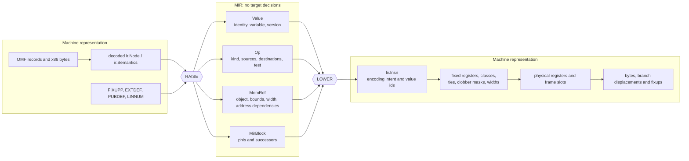

The rules at these doors are stricter than ordinary module ownership:

- The raise may inspect x86, fixups, BC calling conventions, runtime helpers,
  array descriptors, and emulator encodings. It must express their meaning in
  MIR once, so no optimization pass has to rediscover an instruction idiom.
- Every optimization pass implements `MIRTransform.transform(MirBody) ->
  MirBody`. It may reason about values, control flow, aliasing, ranges and
  numeric semantics. It may not choose registers, mnemonics or encodings.
- Lowering chooses an instruction form and records its constraints. It does not
  choose the final register for an unconstrained value.
- Allocation is the only owner of physical placement. Peephole runs afterwards
  because its profitable rewrites depend on that placement.

`tests/test_rule5.py` enforces the MIR side of the boundary by inspecting the
pass source for machine vocabulary.

## Frontend: from OMF to MIR

The frontend does more than disassemble. An OMF object contains the information
needed to distinguish code, data, relocatable operands, runtime calls and
inline control-flow tables. Throwing that information away and reconstructing
it later would make relocation and alias analysis guesses.

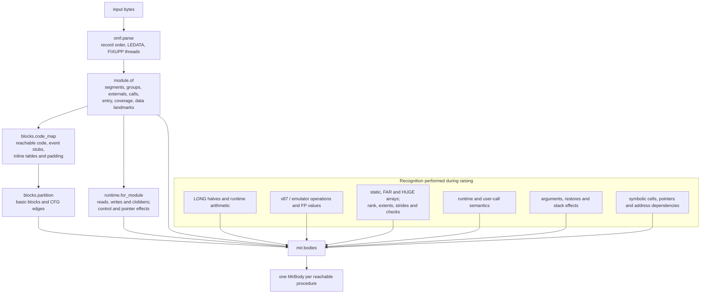

The main ownership split is:

| Concern | Owner |
| --- | --- |
| OMF parsing and record fidelity | `qbopt/objectfile/omf.py` |
| Segment, group, symbol, call and object-bound facts | `qbopt/objectfile/module.py` |
| Instruction lengths and BC emulator forms | `qbopt/frontend/declen.py` |
| Reachability, inline tables and basic blocks | `qbopt/frontend/blocks.py` |
| BC calling and runtime contracts | `qbopt/abi/runtime.py`, `runtime.toml` |
| Idiom recognition | `qbopt/frontend/raising_*.py`, coordinated by `model/mir.py` |
| Pure analyses used by passes | `qbopt/analysis/` |

### Runtime contracts

A call is not a generic barrier when its contract is known. Contracts are
derived once for the module and the same mapping is used by the raise and
lowering.

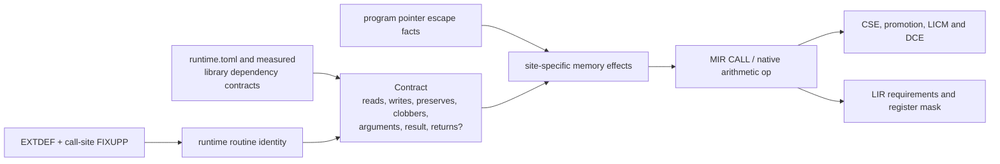

The distinction between fixed runtime storage and writes through a caller
pointer is essential: it permits optimization of program data without claiming
that a call is memory-pure.

### Numeric and bounds policies

Numeric and bounds policy is chosen before optimization and represented in the
operations being optimized. Native-x87 selection is an emission policy. None is
a late patch over already-emitted instructions.

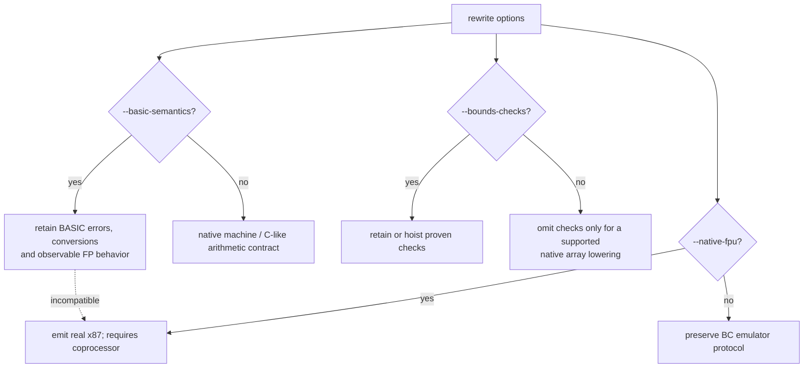

Unsupported unchecked array layouts refuse with a reason; they do not silently
retain a helper and call that success.

## MIR and its optimization fixed point

MIR is SSA over program values. A value has identity and versions a variable;
it has no location. Blocks carry phis and successors. Memory references retain
symbolic object and addressing facts so alias analysis can be conservative
without collapsing all memory into one cell.

The production pass order comes directly from `transform.pipeline()`. The
sequence repeats until the body is unchanged, with a hard limit of 16 rounds.
LCSSA precedes the loop transforms, which consume its explicit exit values.

```mermaid
flowchart LR
    In["raised MirBody"] --> Fold["fold"] --> Decide["decide"] --> Segments["segments"]
    Segments --> LCSSA["lcssa"] --> Hoist["hoist<br/>+ sink stores"] --> Forward["forward"]
    Forward --> DL["drop_loads"] --> DS["drop_stores"] --> Reuse["reuse"]
    Reuse --> CSE["cse<br/>+ FP check folding"] --> Promote["promote"]
    Promote --> Strength["strength"] --> Algebraic["algebraic"]
    Algebraic --> Dead["dead"] --> Place["place"] --> Unroll["unroll"]
    Unroll --> Changed{"body changed?"}
    Changed -->|"yes, round < 16"| Fold
    Changed -->|"no"| Wide["temporary post-pass widening seam"]
    Changed -->|"still changing at 16"| Error["hard convergence error"]
    Wide --> Out["optimized MirBody"]
```

Pass responsibilities are intentionally narrow:

| Family | Passes | Question answered |
| --- | --- | --- |
| Scalar simplification | `fold`, `decide`, `algebraic`, `dead` | What value or control edge is already determined? |
| Memory/value reuse | `segments`, `forward`, `drop_loads`, `drop_stores`, `cse`, `promote` | Can existing data replace work here? |
| Loop optimization | `hoist`, `strength`, `unroll`, `lcssa` | What can leave, stride through, duplicate around, or cross the exit of a loop? |
| Placement in program order | `place` | Where may a surviving definition execute without changing meaning? |
| Division reuse | `reuse` | Can an existing quotient/remainder serve another use? |

`qbopt/analysis/` contains analyses, not phases. Liveness, intervals, loops,
induction, ranges, float facts and available values answer questions without
mutating a body.

### Loop and array data flow

The important loop win is to expose array helpers as native MIR before loop
passes run. Only then can invariants and affine recurrences be shared across
statements.

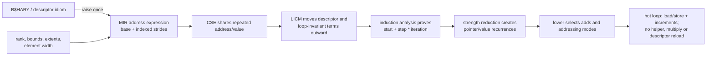

Cost belongs at the correct level. Whether `x * 8` equals `x << 3` is a MIR
fact; whether a shift/add sequence beats `imul` on 386, 486, P5 or P6 is a
lowering decision informed by `backend/timing.py` and `cycles/`. MIR never
names a CPU.

## Lowering and LIR

Lowering turns each MIR operation into one or more target instructions over
virtual values. LIR states all placement constraints explicitly so no later
phase has to infer them from an opcode.

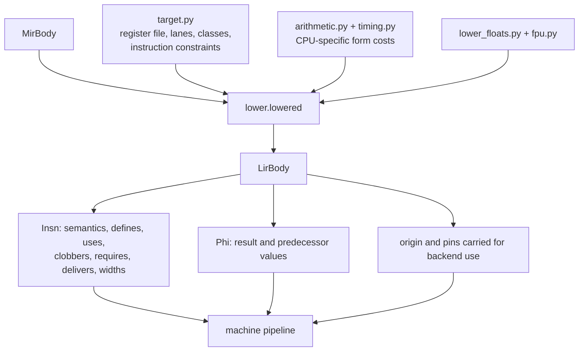

The principal constraints are:

- a fixed register for implicit operands and results;
- a register class, such as the registers usable in 16-bit addressing;
- tied operands for x86 two-address instructions;
- lane overlap for `al`, `ah`, `ax` and `eax`-family names;
- a call clobber mask for values live across a call;
- value widths independent of the instruction that happened to create them;
- symbolic memory/fixup ownership independent of original byte ownership.

## Machine pipeline and allocation

The phase order lives in `qbopt/flow.py`, analogous to LLVM's target pass
configuration. Analyses such as live intervals are invoked by these phases but
are not themselves listed as transformations.

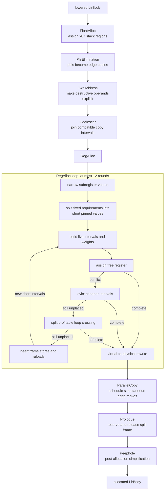

The allocator follows LLVM's greedy shape rather than searching every coloring:

1. Prefer a free legal register.
2. Evict only intervals whose combined weight is cheaper than the incoming one.
3. Split a failed live range at a useful loop boundary before spilling it.
4. Materialize spills into frame slots and allocate the resulting short ranges.
5. Refuse if those rounds do not settle; never emit an unplaced value.

The frame is backend-owned. `frame.py` assigns slots below BC's deepest existing
frame displacement, `spiller.py` inserts loads and stores, and `prologue.py`
reserves the added space at every entry/return path. Reloads created by the
spiller are marked so they cannot be recursively treated like arbitrary source
memory operations.

### LLVM and GCC reference points

The local reference sources are `~/work/other/llvm-project` and the GCC tree
under `~/work/other`. They guide structure and algorithms, not vocabulary above
the MIR boundary.

| qbopt | LLVM analogue | GCC analogue |
| --- | --- | --- |
| `MirBody`, MIR passes | LLVM IR / scalar and loop passes | GIMPLE / tree passes |
| `LirBody` | `MachineFunction` / `MachineInstr` | RTL |
| `phielim.py` | `PHIElimination` | SSA-to-RTL edge moves |
| `twoaddr.py` | `TwoAddressInstructionPass` | target constraints during RTL expansion/reload |
| `coalesce.py` | `RegisterCoalescer` | IRA copy coalescing |
| `analysis/intervals.py` | `LiveIntervals` / spill weights | IRA live ranges and costs |
| `allocate.py` | `RegAllocGreedy` + `VirtRegRewriter` | IRA + LRA |
| `spiller.py` | `InlineSpiller` | LRA spill/reload insertion |
| `prologue.py` | `PrologEpilogInserter` | prologue/epilogue RTL passes |
| `asm.py`, `select.py`, `objwrite.py` | MC assembler, code emitter and object writer | final / assembler output |

Machine-specific ideas copied from either compiler belong in lowering, target
description, allocation or peephole. Their high-level proofs and value
transformations belong in MIR.

## Emission and OMF relocation

Emission is not a byte concatenation. Moving code changes instruction offsets,
self-relative branches, OMF relocation sites, public symbols, line tables,
segment lengths and possibly LEDATA boundaries.

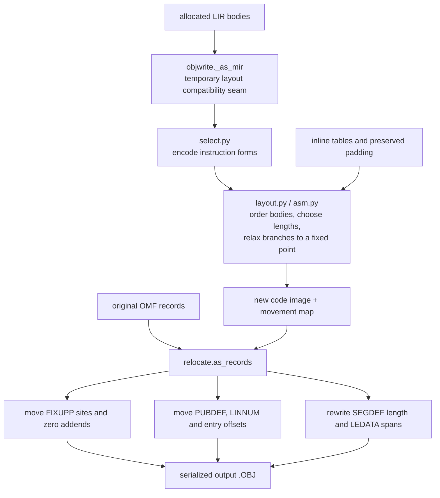

Important invariants:

- Every original code byte is either represented by a surviving instruction,
  deliberately replaced, or preserved as known table/padding data.
- Inserted instructions own no original byte span.
- A relocated operand and the bytes an instruction replaces are separate facts;
  moving one must not accidentally claim the other.
- LINK adds the encoded addend to a fixup target, so a generated relocated field
  is zero-filled before its fixup is applied.
- A branch target may not land inside a replaced region.
- A phi reaching `objwrite` is a hard bug: phis have no encoding.

`objwrite._as_mir` is explicitly a compatibility seam: layout still consumes
MIR-shaped operations after LIR has already been allocated. The intended end
state is for layout and selection to consume `LirBody` directly, removing this
back-conversion and the duplicate assignment channel.

## Atomic refusal and idempotence

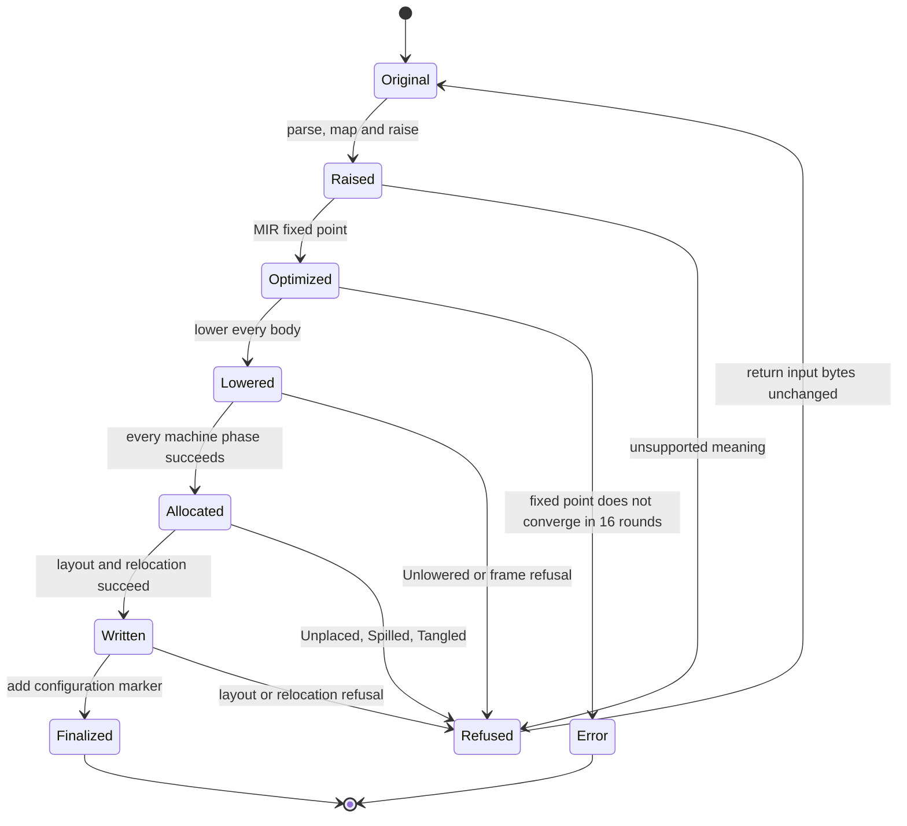

The output marker records the options that affect emitted code. Re-running the
same configuration returns the finalized object unchanged. Re-running it with a
different configuration raises `Finalised` instead of raising already-generated
prologues, spill code and edge copies as if BC had emitted them.

A fallback is never reported as successful optimized output. `wholeseg.Emission`
distinguishes `LIR` from `REFUSED`, and production accepts only `LIR` as a
completed rewrite.

## Source package map

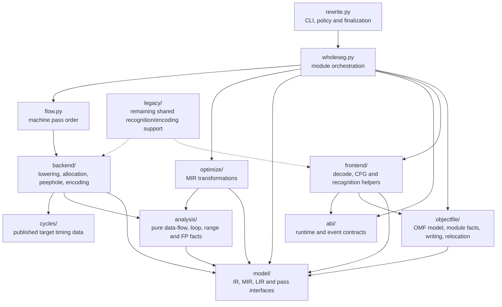

Dependency direction matters:

- orchestration may depend on every phase, but phases do not call the driver;
- analyses depend on models, not on emitting backends;
- MIR optimizations do not import backend target or register policy;
- backend modules may consume MIR/LIR but do not mutate OMF records directly;
- `objectfile/` owns record mutation and serialization.

## Diagnostics and verification

`tools/stages.py` receives the bodies from the same production run through
`wholeseg.emitted(..., watch=...)`. It dumps each MIR round, lowering, every
machine phase and the final route. It must not reconstruct a parallel pipeline,
because a newly recomputed allocation is not evidence about the bytes that
failed.

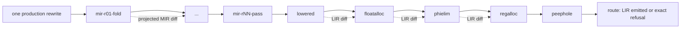

Verification is layered:

| Gate | What it establishes |
| --- | --- |
| OMF round trip | Untouched records and bytes remain identical |
| Focused regression | A known symptom fails without its fix and passes with it |
| MIR/LIR verifier | SSA, phis, constraints, placement and frame invariants hold |
| Stage diff | The first transformation that changes a bad program is identified |
| Real-program matrix | Linked programs preserve answers across supported BC configurations |
| Scoreboard and timing | The emitted object, not BC's input or hidden helpers, is being measured |

The full test suite is a release gate, not the inner development loop. Work on a
failure begins with the smallest real reproducer and adjacent stage dumps; broad
suites run after the implementation has a concrete reason to pass.

## Optimization roadmap checklist

Implement these in dependency order. A checked item means a foundation is
integrated and verified, or an optimizing pass additionally improves at least
one documented target without materially regressing another.

### Foundation

- [ ] Canonicalize loops with dedicated preheaders, latches and exits
  (`LoopSimplify`).
  Raw-MIR inventory (2026-09-10): 489 objects, 587 bodies, 465 natural
  loops across `fixtures/omf` and `fixtures/bench`. Every loop already has
  a dedicated preheader and exits; only VBDOS PITSNAP in FPBENCH and NBODY
  has multiple latches. General canonicalization remains required, but is
  not the current arithmetic-kernel optimization blocker.
- [x] Preserve loop-exit SSA explicitly (`LCSSA`). Single-edge dedicated exits
  are closed before loop transforms in each fixed-point round; unsupported exit shapes remain
  unchanged until `LoopSimplify` supplies their canonical CFG.
- [ ] Canonicalize primary counters and derived recurrences
  (`IndVarSimplify`).
  Existing recurrences can replace redundant termination counters across
  internal branches, not just two-block loops. A single latch, header-only
  exit, complete non-wrapping trip count and unobserved counter are still
  required; final counter stores are reconstructed at the exit. IVARM
  exercises the conditional-store shape on all three compilers.
  Raise-time word normalization removes unused upper-word preservation from
  16-bit loads/copies. Wide or unknown readers, phi/merge propagation and
  body-exit values retain it. IVWORD covers the INTEGER-branch dependency
  that previously kept QB/PDS's redundant loop counters alive.
- [x] Build `MemorySSA`: one def-use graph for loads, stores and call effects.
  `analysis/memoryssa.py` provides live-on-entry, memory uses/definitions and
  join/backedge phis. Calls conservatively define memory. This is an analysis
  foundation; optimization consumers and precise clobber queries remain below.
- [ ] Refine alias, object-identity, escape and per-argument mod/ref facts used
  by `MemorySSA`.
  Whole-pointer accesses proven inside one allocation now use shared SSA
  bases and constant byte offsets to exclude disjoint writes. Exact dominating
  stores supply constants or SSA values; unknown roots and unbounded offsets
  remain conservative. Facts are rebuilt after MIR changes.
  At raise time, forward must-facts retain fixed array extents and bounded
  pointer offsets across unknown branches. Accesses are annotated per
  occurrence only when every incoming path proves ownership. Calls, descriptor
  writes, allocation generations and value widths constrain the proof;
  general symbolic ranges remain unfinished.
  Counted-loop ranges also use signed comparison facts on dominating,
  dedicated branch edges. Derived offsets are recomputed in that scope;
  a bound from one arm is not exported through its join. This enables
  alias-sensitive motion around guarded static-array accesses.
  Constant-extent dynamic arrays now also use an inductive forward proof:
  numeric range joins, loop-header widening, guard refinement and checked
  stores preserve allocation/counter facts without enumerating iterations.
  Runtime-sized extents and broader lifetime/mod-ref precision remain open.

### High-impact MIR passes

- [ ] Implement scalar replacement of aggregates (`SROA`) for descriptors,
  UDT fields, frame temporaries and independently addressable array metadata.
- [ ] Feed SROA results into promotion so scalar values survive across BC
  statement boundaries.
- [ ] Implement global value numbering with partial redundancy elimination
  (`GVN-PRE`) for scalar and memory expressions.
  Scalar full redundancy at joins is implemented: when every incoming edge
  has a dominating provider, a phi replaces the repeated computation; input
  phis are translated separately on each incoming edge. Missing scalar
  providers can be inserted on dedicated unconditional edges after CSE
  stabilizes. MemorySSA-backed value phis also eliminate whole scalar loads
  already supplied on every incoming path by loads or stores.
  Whole-pointer phis are translated per incoming edge for provider matching;
  clobber checks retain the original address inside the join and use the
  translated address on the incoming path. Missing-path
  load insertion, critical-edge splitting, target profitability and strict
  floating reuse remain open.
- [ ] Replace the separate load/store cleanup rules with MemorySSA-based load
  elimination and dead-store elimination.
- [x] Implement sparse conditional constant propagation (`SCCP`) over values
  and executable CFG edges.
  `analysis/constant_cycles.py` combines its sparse value worklist with
  executable-edge discovery, feeding feasible phi inputs back into branch
  evaluation. New backedges invalidate optimistic constants; pending reachable
  values become overdefined before completion, and unresolved conditions keep
  every successor. A looped entry also retains its unknown initial caller input.
  `decide` uses this solver with the existing semantic comparison evaluator and
  byte-owning unreachable cleanup. Memory facts are conservative seeds from the
  existing all-path analysis, not speculative conditional-memory facts.
  Conditional-phi branch resolution is verified in one round. BOOLS QB's final
  before/after assembly is identical; no suite speedup is claimed for this change.
  Reference: local LLVM revision `338e0c94943a6fb917c276bbbd9ff4b6cd6dd71e`,
  `llvm/lib/Transforms/Utils/SCCPSolver.cpp:1426` and the solver header's
  `resolvedUndefsIn` contract. LLVM undef semantics are not permission to
  treat unknown BASIC inputs or unsupported machine effects as unreachable.
- [ ] Consolidate branch folding, empty-block removal, jump threading and
  unreachable cleanup into `SimplifyCFG`.
  `decide` now bypasses empty fallthrough blocks as well as jump-only blocks,
  including implicit incoming edges. Phi destinations and cycles are preserved;
  converging branch arms become an unconditional edge. Dead blocks retain byte
  ownership. BOOLS has no empty transit blocks on its live path across all three
  compilers; final assembly remains unchanged (the emitter already removed jumps).
  Linear-block merging and consolidation into a separate pass remain open.

### Loop profitability and specialization

- [ ] Add register-pressure and target-cost formula selection to induction
  strength reduction; never create a recurrence merely because one is legal.
- [ ] Hoist invariant bounds checks into loop preguards when checks are enabled.
  Checked dynamic accesses already become native arithmetic when every index
  is proven within the live descriptor's bounds. Unknown indices or descriptor
  facts retain HARY; loop preguards remain unimplemented.
- [ ] Implement loop versioning/unswitching for invariant bounds, alias and
  numeric-environment conditions.
- [ ] Add loop rotation only where it improves the canonical form or emitted
  branch structure.
- [ ] Delete provably unobservable loops and retain required final stores,
  synchronization and exceptional behavior.

### Interprocedural optimization

- [ ] Infer user-procedure attributes: `readonly`, `writeonly`, `nocapture`,
  `noreturn`, argument constants and precise mod/ref effects.
- [ ] Propagate constants and effects across procedure boundaries (`IPSCCP`).
- [ ] Inline selectively when doing so exposes a measured optimization; keep
  runtime-idiom recognition in the raise rather than implementing it as
  generic inlining.
- [ ] Remove unreachable procedures and unused public/internal definitions
  where OMF linkage permits it (`GlobalDCE`).

### Machine backend

- [ ] Add global machine copy propagation after allocation.
  `backend/copyprop.py` eliminates equal-register copies using byte-level
  agreement over all reachable incoming edges. Operand substitution and
  demonstrated target improvement remain open.
- [ ] Add machine CSE and dead-machine-instruction elimination over allocated
  LIR.
- [ ] Add branch folding and tail merging after final block placement.
- [ ] Extend rematerialization, spill folding, spill-slot reuse and live-range
  splitting using measured interval costs.
  Lowering rematerializes shared immediate PRINT arguments, including relocated
  addresses, without extending their register lifetimes across calls. QB FPDEEP
  removes three spill slots and falls from 1652 to 1570 modeled cost; general
  allocator rematerialization and the other items remain open.
- [ ] Add instruction scheduling for 486/P5/P6 only after their latency,
  dependency and pairing models are validated against primary sources.

### Deliberately deferred

- [ ] Reconsider loop/SLP vectorization only if a supported target gains a
  vector register model; it is not useful for the current 386/x87 baseline.
- [ ] Reconsider aggressive floating reassociation only under an explicit
  semantics mode that permits it.
- [ ] Reconsider broad inlining, tail-call elimination and PGO only after the
  memory, loop and scalar pipelines above stop dominating the remaining gaps.

## Known architecture debt

These are boundary defects with an owner, not permission to add more cross-layer
knowledge:

1. `transform.widened()` still recognizes a BC register-pair idiom after the
   MIR pass fixed point. Recognition must finish moving into the raise; encoding
   belongs below lowering.
2. MIR still carries source-machine provenance (`node`, `made`, byte coverage,
   fixup identity and `MirBody.origin`). Passes should see only the parts needed
   to preserve semantics; byte/fixup provenance belongs in a side map owned by
   lowering and emission.
3. `objwrite._as_mir()` converts allocated LIR back into MIR-shaped operations
   because layout has not yet been made a direct LIR consumer.
4. Target costing is narrower than LLVM/GCC's formula selection. Loop strength
   reduction and unrolling need register-pressure and target-cost comparisons,
   not unconditional pattern replacement.
5. Strict numeric behavior and checked-loop preguards are incomplete. Policy is
   already separate (`--basic-semantics`, `--bounds-checks`); broader lowering
   coverage must preserve that separation.

The project goal remains the architectural acceptance criterion: produce what a
modern optimizing compiler would produce, with every documented suite program
within 1.5x of its hand-derived target. No diagrammed phase is complete merely
because it exists; it is complete when its output is correct, measured, and
moves those targets.
