# Architecture

`qbopt` is a post-compiler: it reads the OMF `.OBJ` produced by BC, raises
the program to SSA-based MIR, optimizes whole bodies, lowers to x86 LIR,
allocates physical resources, and writes a new linkable `.OBJ`.

The architectural rule is simple:

> Recognition happens while raising. Program optimization is machine-independent
> MIR. Machine choices return only at lowering and remain below it.

This document describes the production path in the current source tree. Historical
measurements and milestones belong in `docs/takeover-progress.md`; optimization
targets and their evidence belong in `docs/targets.md`.

## End-to-end pipeline

```mermaid
flowchart LR
    BC["BC.EXE<br/>QuickBASIC / PDS / VBDOS"] -->|"OMF .OBJ"| Parse

    subgraph Frontend["Frontend: recover the program from BC's machine code"]
        direction LR
        Parse["OMF parse<br/>objectfile/omf.py"] --> Module["Module facts<br/>objectfile/module.py"]
        Module --> Map["Code map and CFG<br/>frontend/blocks.py"]
        Map --> Raise["Raise and recognize<br/>model/mir.py + frontend/raising_*.py"]
    end

    Raise -->|"MirBody: SSA values, phis, memory facts"| Opt

    subgraph Middle["Machine-independent middle end"]
        direction LR
        Opt["MIR fixed point<br/>optimize/transform.py"] --> MirOut["Optimized MirBody"]
    end

    MirOut -->|"the lowering boundary"| Lower

    subgraph Backend["Machine backend"]
        direction LR
        Lower["Instruction selection<br/>backend/lower.py"] --> LIR["LirBody<br/>virtual values + constraints"]
        LIR --> Machine["Machine phases<br/>flow.machine()"]
        Machine --> Physical["Allocated LIR<br/>physical registers + frame slots"]
        Physical --> Write["Select, layout, fresh OMF<br/>backend/omfwrite.py"]
    end

    Write -->|"OMF .OBJ"| Link["LINK.EXE"]

    Refuse["Any unsupported contract or encoding"] -.->|"strict default"| Error["Exit nonzero; write no output"]
    Refuse -.->|"explicit --allow-unchanged"| Original["Retain original .OBJ"]
    Raise -.-> Refuse
    Lower -.-> Refuse
    Machine -.-> Refuse
    Write -.-> Refuse
```

There is one production optimizer and one production backend. The former
machine-code rewrite arm has been removed. `qbopt/legacy/` remains only where
raising or encoding still shares old recognition data; it is not a second
optimization route.

## The two boundaries

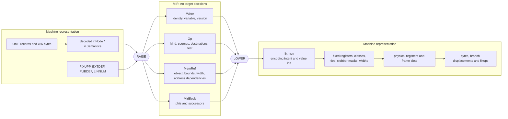

The rules at these doors are stricter than ordinary module ownership:

- The raise may inspect x86, fixups, BC calling conventions, runtime helpers,
  array descriptors, and emulator encodings. It must express their meaning in
  MIR once, so no optimization pass has to rediscover an instruction idiom.
- Every optimization pass implements `MIRTransform.transform(MirBody) ->
  MirBody`. It may reason about values, control flow, aliasing, ranges and
  numeric semantics. It may not choose registers, mnemonics or encodings.
- Lowering chooses an instruction form and records its constraints. It does not
  choose the final register for an unconstrained value.
- Allocation is the only owner of physical placement. Peephole runs afterwards
  because its profitable rewrites depend on that placement.

`tests/test_rule5.py` enforces the MIR side of the boundary by inspecting the
pass source for machine vocabulary.

## Frontend: from OMF to MIR

The frontend does more than disassemble. An OMF object contains the information
needed to distinguish code, data, relocatable operands, runtime calls and
inline control-flow tables. Throwing that information away and reconstructing
it later would make relocation and alias analysis guesses.

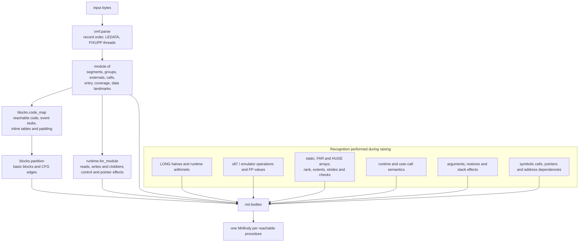

The main ownership split is:

| Concern | Owner |
| --- | --- |
| OMF parsing and record fidelity | `qbopt/objectfile/omf.py` |
| Segment, group, symbol, call and object-bound facts | `qbopt/objectfile/module.py` |
| Instruction lengths and BC emulator forms | `qbopt/frontend/declen.py` |
| Reachability, inline tables and basic blocks | `qbopt/frontend/blocks.py` |
| BC calling and runtime contracts | `qbopt/abi/runtime.py`, `runtime.toml` |
| Idiom recognition | `qbopt/frontend/raising_*.py`, coordinated by `model/mir.py` |
| Pure analyses used by passes | `qbopt/analysis/` |

Established terminal calls lose their false return edges before body ownership
and SSA construction. Registered `B$OEGA` error handlers are independent entries,
as are otherwise detached relocated RESUME destinations. Neither inherits the
main body's SSA state by falling through `END`. Inline statement tables remain
owned by their preceding block even when that block is terminal.

ERRENT exercises an actual division error and `RESUME NEXT` with
`--basic-semantics`: baseline and optimized programs print `11` then `DONE` on
QB, PDS and VBDOS, both ordinary and event configurations. Its PDS assembly is:

```asm
; BC registration and handler (relocations shown symbolically)
0048  mov ax,0084h
004b  push cs
004c  push ax
004d  call far B$OEGA
; ...
007f  call far B$CEND
0084  call far B$FERR       ; independent runtime entry, not END fallthrough
0089  mov [caught],ax
008c  call far B$RESN

; optimized
0046  push cs
0047  push 0081h
004a  call far B$OEGA
; ...
007c  call far B$CEND
0081  call far B$FERR
0086  mov [caught],ax
0089  call far B$RESN
```

The repair restores emission for all 15 DIVMOD variants; it is correctness
coverage, not a claimed speedup. Recognition also accepts the lowered immediate
push form so an emitted object's handler remains discoverable.

### Runtime contracts

A call is not a generic barrier when its contract is known. Contracts are
derived once for the module and the same mapping is used by the raise and
lowering.

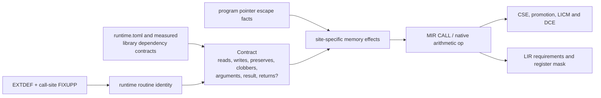

The distinction between fixed runtime storage and writes through a caller
pointer is essential: it permits optimization of program data without claiming
that a call is memory-pure.

### Numeric and bounds policies

Numeric and bounds policy is chosen before optimization and represented in the
operations being optimized. Native-x87 selection is an emission policy. None is
a late patch over already-emitted instructions.

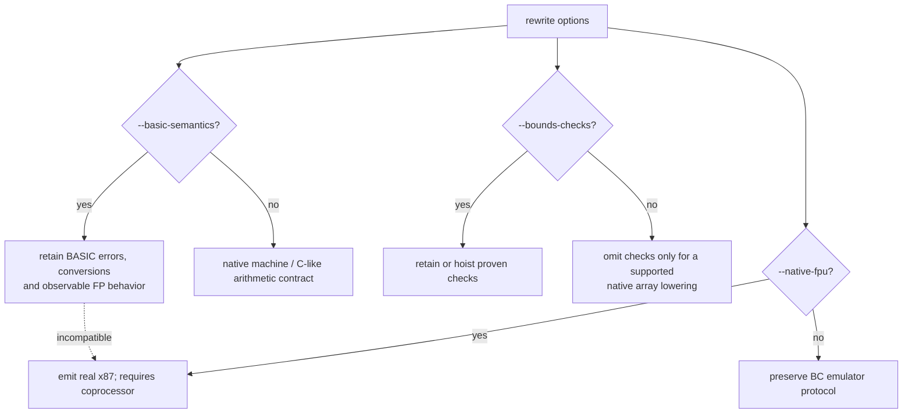

Unsupported unchecked array layouts refuse with a reason; they do not silently
retain a helper and call that success.

## MIR and its optimization fixed point

MIR is SSA over program values. A value has identity and versions a variable;
it has no location. Blocks carry phis and successors. Memory references retain
symbolic object and addressing facts so alias analysis can be conservative
without collapsing all memory into one cell.

The production pass order comes directly from `transform.pipeline()`. The
sequence repeats until the body is unchanged, with a hard limit of 16 rounds.
LCSSA precedes the loop transforms, which consume its explicit exit values.

Within `strength`, equal-stride sharing (`ivshare`) preserves observed upper
bits only with a common-source proof. Dead-value cleanup exposes exit-only
ADD/SUB producers; `exitsink` moves them through single-input exit phis.
Unknown readers and live flag dependencies retain the original computation.

```mermaid
flowchart LR
    In["raised MirBody"] --> Fold["fold"] --> Decide["decide"] --> LoopSimplify["loopsimplify"]
    LoopSimplify --> LCSSA["lcssa"] --> Hoist["hoist<br/>+ sink stores"] --> DS["drop_stores"]
    DS --> GVN["gvn<br/>scalar + memory PRE<br/>divide reuse"] --> Promote["promote"]
    Promote --> Strength["strength"] --> Algebraic["algebraic"]
    Algebraic --> Dead["dead"] --> Place["place"] --> Unroll["unroll"]
    Unroll --> Fill["fill"] --> Changed{"body changed?"}
    Changed -->|"yes, round < 16"| Fold
    Changed -->|"no"| Wide["temporary post-pass widening seam"]
    Changed -->|"still changing at 16"| Error["hard convergence error"]
    Wide --> Out["optimized MirBody"]
```

Pass responsibilities are intentionally narrow:

| Family | Passes | Question answered |
| --- | --- | --- |
| Scalar simplification | `fold`, `decide`, `algebraic`, `dead` | What value or control edge is already determined? |
| Memory/value reuse | `drop_stores`, `gvn`, `promote` | Can existing data replace work here? |
| Loop optimization | `hoist`, `strength`, `unroll`, `lcssa` | What can leave, stride through, duplicate around, or cross the exit of a loop? |
| Placement in program order | `place` | Where may a surviving definition execute without changing meaning? |
| Division reuse | `gvn` | Can an existing quotient/remainder serve another use? |

`qbopt/analysis/` contains analyses, not phases. Liveness, intervals, loops,
induction, ranges, float facts and available values answer questions without
mutating a body.

### Loop and array data flow

The important loop win is to expose array helpers as native MIR before loop
passes run. Only then can invariants and affine recurrences be shared across
statements.

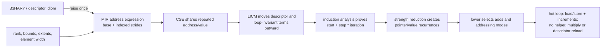

Cost belongs at the correct level. Whether `x * 8` equals `x << 3` is a MIR
fact; whether a shift/add sequence beats `imul` on 386, 486, P5 or P6 is a
lowering decision informed by `backend/timing.py` and `cycles/`. MIR never
names a CPU.

## Lowering and LIR

Lowering turns each MIR operation into one or more target instructions over
virtual values. LIR states all placement constraints explicitly so no later
phase has to infer them from an opcode.

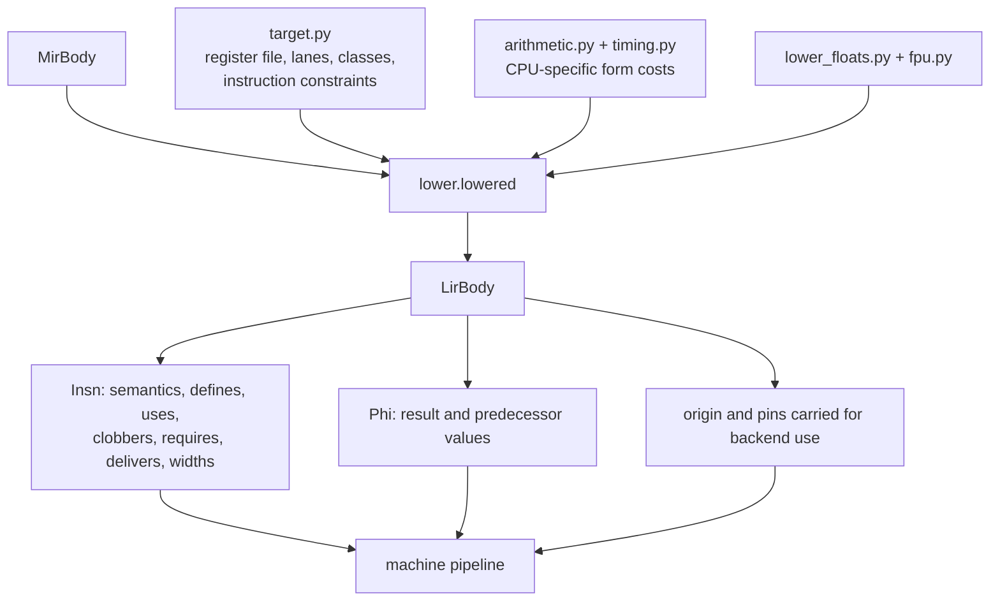

The principal constraints are:

- a fixed register for implicit operands and results;
- a register class, such as the registers usable in 16-bit addressing;
- tied operands for x86 two-address instructions;
- lane overlap for `al`, `ah`, `ax` and `eax`-family names;
- a call clobber mask for values live across a call;
- value widths independent of the instruction that happened to create them;
- symbolic memory/fixup ownership independent of original byte ownership.

## Machine pipeline and allocation

The phase order lives in `qbopt/flow.py`, analogous to LLVM's target pass
configuration. Analyses such as live intervals are invoked by these phases but
are not themselves listed as transformations.

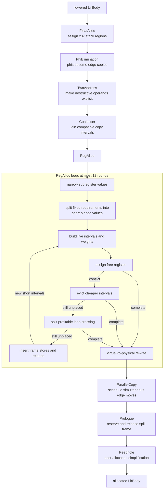

The allocator follows LLVM's greedy shape rather than searching every coloring:

1. Prefer a free legal register.
2. Evict only intervals whose combined weight is cheaper than the incoming one.
3. Split a failed live range at a useful loop boundary before spilling it.
4. Materialize spills into frame slots and allocate the resulting short ranges.
5. Refuse if those rounds do not settle; never emit an unplaced value.

The frame is backend-owned. `frame.py` assigns slots below BC's deepest existing
frame displacement, `spiller.py` inserts loads and stores, and `prologue.py`
reserves the added space at every entry/return path. Reloads created by the
spiller are marked so they cannot be recursively treated like arbitrary source
memory operations.

### LLVM and GCC reference points

The local reference sources are `~/work/other/llvm-project` and the GCC tree
under `~/work/other`. They guide structure and algorithms, not vocabulary above
the MIR boundary.

| qbopt | LLVM analogue | GCC analogue |
| --- | --- | --- |
| `MirBody`, MIR passes | LLVM IR / scalar and loop passes | GIMPLE / tree passes |
| `LirBody` | `MachineFunction` / `MachineInstr` | RTL |
| `phielim.py` | `PHIElimination` | SSA-to-RTL edge moves |
| `twoaddr.py` | `TwoAddressInstructionPass` | target constraints during RTL expansion/reload |
| `coalesce.py` | `RegisterCoalescer` | IRA copy coalescing |
| `analysis/intervals.py` | `LiveIntervals` / spill weights | IRA live ranges and costs |
| `allocate.py` | `RegAllocGreedy` + `VirtRegRewriter` | IRA + LRA |
| `spiller.py` | `InlineSpiller` | LRA spill/reload insertion |
| `prologue.py` | `PrologEpilogInserter` | prologue/epilogue RTL passes |
| `asm.py`, `select.py`, `omfwrite.py` | MC assembler, code emitter and object writer | final / assembler output |

Machine-specific ideas copied from either compiler belong in lowering, target
description, allocation or peephole. Their high-level proofs and value
transformations belong in MIR.

## Emission and OMF relocation

Emission is not a byte concatenation. Moving code changes instruction offsets,
self-relative branches, OMF relocation sites, public symbols, line tables,
segment lengths and possibly LEDATA boundaries.

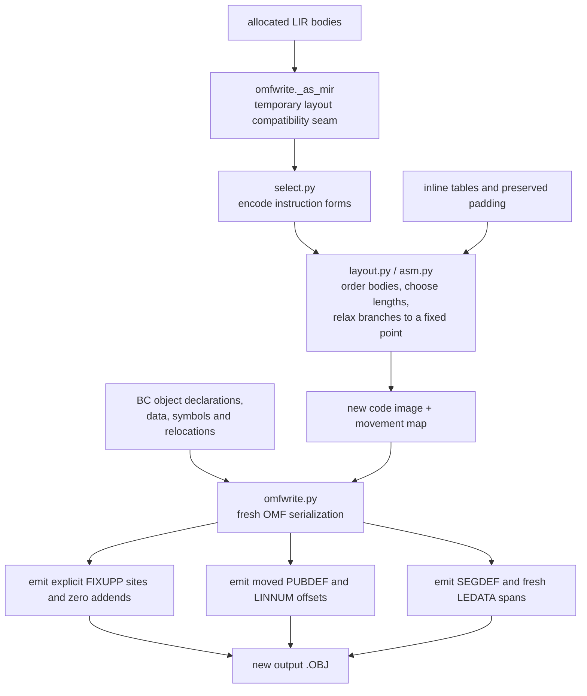

Important invariants:

- Every original code byte is either represented by a surviving instruction,
  deliberately replaced, or preserved as known table/padding data.
- Inserted instructions own no original byte span.
- A relocated operand and the bytes an instruction replaces are separate facts;
  moving one must not accidentally claim the other.
- LINK adds the encoded addend to a fixup target, so a generated relocated field
  is zero-filled before its fixup is applied.
- A branch target may not land inside a replaced region.
- A phi reaching `omfwrite` is a hard bug: phis have no encoding.

`omfwrite._as_mir` is explicitly a compatibility seam: layout still consumes
MIR-shaped operations after LIR has already been allocated. The intended end
state is for layout and selection to consume `LirBody` directly, removing this
back-conversion and the duplicate assignment channel.

## Atomic refusal and idempotence

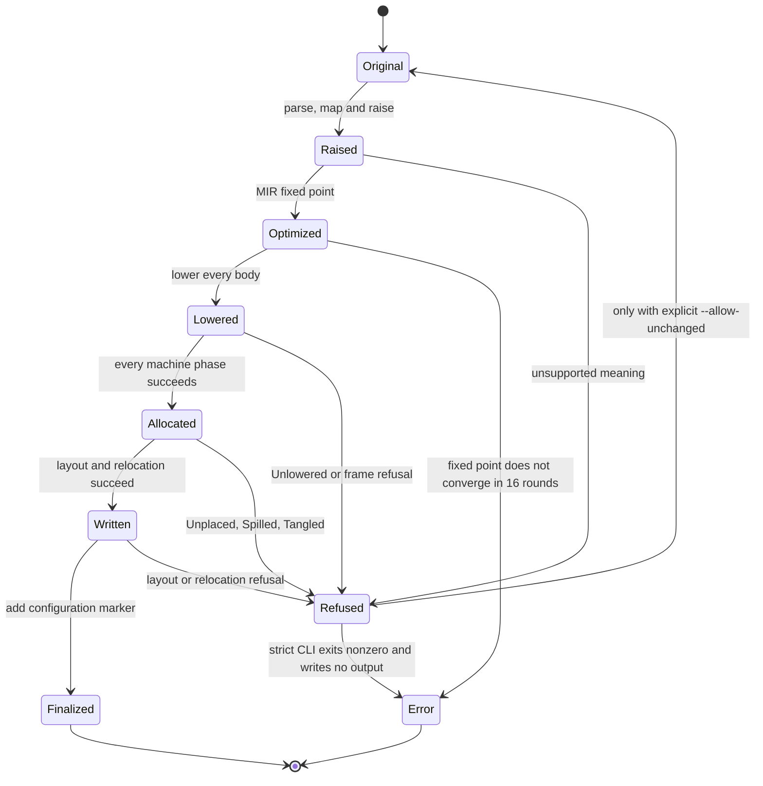

The output marker records the options that affect emitted code. Re-running the
same configuration returns the finalized object unchanged. Re-running it with a
different configuration raises `Finalised` instead of raising already-generated
prologues, spill code and edge copies as if BC had emitted them.

A fallback is never reported as successful optimized output. `wholeseg.Emission`
distinguishes `LIR` from `REFUSED`; the production CLI raises on `REFUSED` and
buffers every object in a link unit before writing any of them.

## Source package map

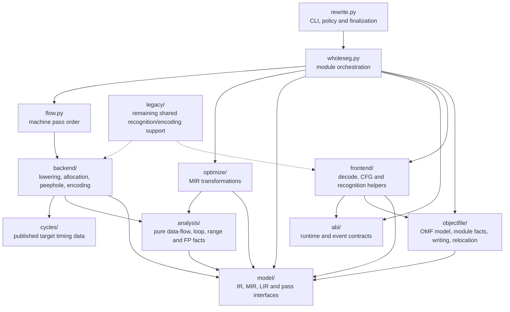

Dependency direction matters:

- orchestration may depend on every phase, but phases do not call the driver;
- analyses depend on models, not on emitting backends;
- MIR optimizations do not import backend target or register policy;
- backend modules may consume MIR/LIR but do not mutate OMF records directly;
- `objectfile/` owns record mutation and serialization.

## Diagnostics and verification

`tools/stages.py` receives the bodies from the same production run through
`wholeseg.emitted(..., watch=...)`. It dumps each MIR round, lowering, every
machine phase and the final route. It must not reconstruct a parallel pipeline,
because a newly recomputed allocation is not evidence about the bytes that
failed.

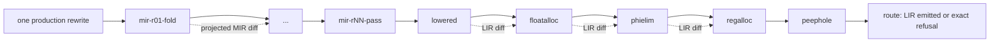

Verification is layered:

| Gate | What it establishes |
| --- | --- |
| OMF round trip | Untouched records and bytes remain identical |
| Focused regression | A known symptom fails without its fix and passes with it |
| MIR/LIR verifier | SSA, phis, constraints, placement and frame invariants hold |
| Stage diff | The first transformation that changes a bad program is identified |
| Real-program matrix | Linked programs preserve answers across supported BC configurations |
| Scoreboard and timing | The emitted object, not BC's input or hidden helpers, is being measured |

The full test suite is a release gate, not the inner development loop. Work on a
failure begins with the smallest real reproducer and adjacent stage dumps; broad
suites run after the implementation has a concrete reason to pass.

## Optimization roadmap checklist

Implement these in dependency order. A checked item means a foundation is
integrated and verified, or an optimizing pass additionally improves at least
one documented target without materially regressing another.

### Foundation

- [ ] Canonicalize loops with dedicated preheaders, latches and exits
  (`LoopSimplify`).
  Raw-MIR inventory (2026-09-10): 489 objects, 587 bodies, 465 natural
  loops across `fixtures/omf` and `fixtures/bench`. Every loop already has
  a dedicated preheader and exits; only VBDOS PITSNAP in FPBENCH and NBODY
  has multiple latches. General canonicalization remains required, but is
  not the current arithmetic-kernel optimization blocker.
  `loopsimplify` now groups predecessor edges into a preheader or unique
  latch, and splits exits shared with outside predecessors. Phi inputs are
  merged in the new block; unsupported transfers or malformed phis leave the
  loop unchanged atomically. Nested-loop membership is recomputed after edits.
  The pass runs before LCSSA, following LLVM LoopSimplify's structural contract.
  Jump threading preserves dedicated preheaders. PL_MOVE's MDL_ANGLEMOD
  exposed the interaction: Decide bypassed the second loop's empty preheader,
  LoopSimplify recreated it, and optimization aborted after 16 rounds.
  The real-object regression checks convergence while retaining both loops.
  Qrender integration (2026-09-11) exposed a second boundary defect:
  layout repaired implicit edges only for cloned bodies. BG_BAND's new
  exit block was skipped, leaving the pixel counter in AX for the row
  increment; the renderer never finished painting the loading screen.
  Layout now materializes displaced fallthroughs for every body:

  ```asm
  ; before (wrong)             ; after
  jle pixelLoop                jle pixelLoop
  inc ax                       jmp exitBridge
  mov [bp-16h],ax               nextRow: inc ax
                               mov [bp-16h],ax
                               ; exitBridge reloads AX from [bp-16h],
                               ; restores SI/DI, then jumps to nextRow.
  ```

  With only SCREEN rebuilt, the native-FPU E1M1 run completes at 23.72 FPS
  (23 frames, 19 measured intervals), and BENCH.BMP exactly matches the
  validated image. Disabling LoopSimplify only in SCREEN independently
  restores the same result; the fix keeps the pass enabled. Regression:
  `tests/test_loop_exit_layout.py`, fail-first and mutation-checked.
  Build, screenshots and per-stage evidence: `/tmp/qbopt-quake-launch.X8v5aq`.
  Full rebuild with the repair: all 21 native-FPU modules emit, link and
  have complete reachable-code coverage. E1M1 completes at 23.42 FPS
  (42.692 ms mean across 19 measured intervals; 23 frames total), with
  byte-identical BENCH.BMP. Evidence: `/tmp/qbopt-quake-fixed.8BnoLI`.
  NBODY and FPBENCH's real PITSNAP loops now have one backedge. NBODY's
  native-FPU object shrinks 4082 → 4079 bytes (modeled cost 343576 → 343556)
  because its two retry trampolines become one:

  ```asm
  ; before                           ; after
  jl retryB                          jl retryA
  ; ...                              ; ...
  retryA: jmp readTimer               retryA: jmp readTimer
  retryB: jmp readTimer
  ```

  BC and both optimized variants agree on all 24 physics outputs plus DONE
  at ten steps. Observed ticks: BC 3128, before 674, after 674; no timing
  improvement is established, and the prior PIT-instrument warning still
  applies. Evidence: `/tmp/qbopt-loopsimplify-run.6jnfLx`; full stage dumps:
  `/tmp/qbopt-loopsimplify-nbody-20260911`. General coverage remains open:
  irreducible, entry-header and unsupported-transfer loops are not normalized.
- [x] Preserve loop-exit SSA explicitly (`LCSSA`). Dedicated exits
  are closed before loop transforms in each fixed-point round; unsupported exit shapes remain
  unchanged until `LoopSimplify` supplies their canonical CFG.
  A single exit can now merge several exiting edges, provided each incoming
  edge is dominated by the value's definition. The regression fails when that
  dominance guard is removed. Distinct dedicated exits now receive exit phis,
  with downstream SSA merges where their values meet. Bypass phi inputs are
  repaired on their incoming edges; a direct use reachable without a defining
  exit is left unchanged rather than supplied an invented value.
  Real PDS `fixtures/regressions/lcmerge-p-g2.obj` exercises two `EXIT DO`
  paths and an accumulator use after their join. Its MIR gains two exit phis
  and one downstream merge; all five focused regressions pass, including a
  following cycle and a bypass join. Baseline and both native builds print
  `COUNT=5`, `TOTAL=11`, `DONE`, with zero compile/link errors. LCSSA disabled
  and enabled emit identical 939-byte objects; no speedup is claimed.
  Relevant emitted assembly is unchanged on both sides:

  ```asm
  ; before                        ; after
  cmp cx,0Ah                      cmp cx,0Ah
  jl short 005Bh                  jl short 005Bh
  jmp short 006Fh                 jmp short 006Fh
  cmp bx,cx                       cmp bx,cx
  jne short 0061h                 jne short 0061h
  jmp short 006Fh                 jmp short 006Fh
  ; ... loop update ...           ; ... loop update ...
  add eax,1                       add eax,1
  mov [0],eax                     mov [0],eax
  ```

  The final store has the same relocated accumulator address. Compile/link
  logs, both complete listings, screenshot and every stage:
  `/tmp/qbopt-lcssa-merge.g9W4To`. The earlier `lcexit-p-g2.obj` witness has
  only memory uses after its exits and does not exercise this SSA merge.
  Exit values reaching a bypass join are rewritten on the incoming edge,
  even when the exit does not dominate the join. This fixes qrender's
  `MDL_FIRE` repeatedly adding six phis until the 16-round limit.
  With the hash-checked qrender contracts and the layout repair above,
  both modules now emit and the full optimized E1M1 build runs correctly.
  Exit-value evaluation now follows single-edge exit phis and rewrites
  downstream phi inputs on their incoming edges. ADDRM's closed-SSA long sum
  becomes 210 outside the loop; observed recurrences remain intact. Isolated
  before/after lowering removes `mov eax,0` plus the loop's `add eax,ecx`,
  replacing the final store's source with `mov ebx,210`. Both objects and BC
  print `T=210`, `U=210`, `DONE` identically in DOS (2026-09-11); dumps,
  binaries and screenshot: `/tmp/qbopt-lcssa-exit.ihku8G`.
  This removes a pass-order dependency, not an additional full-pipeline
  speedup: the existing ordering already optimizes this fixture.
- [ ] Canonicalize primary counters and derived recurrences
  (`IndVarSimplify`).
  Existing recurrences can replace redundant termination counters across
  internal branches, not just two-block loops. A single latch, header-only
  exit, complete non-wrapping trip count and unobserved counter are still
  required; final counter stores are reconstructed at the exit. IVARM
  exercises the conditional-store shape on all three compilers.
  Raise-time word normalization removes unused upper-word preservation from
  16-bit loads/copies. Wide or unknown readers, phi/merge propagation and
  body-exit values retain it. IVWORD covers the INTEGER-branch dependency
  that previously kept QB/PDS's redundant loop counters alive.
  Exact trip counts now survive canonical `counter != bound` tests (and
  equivalent equality exit branches). The signed progression must reach the
  bound exactly in its direction of travel without wrapping. Zero-trip,
  overshooting and wrap-dependent progressions retain no finite-count proof.
  IVARM's `7, 10, ..., 34` recurrence therefore retains its ten-iteration count
  after the original counter is removed.
  Arithmetic consumers now qualify too: the recurrence's own update is
  excluded by SSA definition, not by rejecting every ADD/SUB. NESTED's outer
  loop reuses `i*10`, removing its spilled termination counter. Native objects
  shrink PDS 865 → 850, QB 845 → 830 and VBDOS 1049 → 1034 bytes. Each
  compiler's baseline and both optimized binaries print `T=675`, `DONE`
  identically, with successful links and screenshots for all three families.
  The strengthened NESTED regression fails when
  the arithmetic exclusion is restored. Before/after outer-loop tails:

  ```asm
  ; before                        ; after
  mov dx,[bp-2]
  inc dx
  add ax,0Ah                      add ax,0Ah
  add bx,0Ch                      add bx,0Ch
  mov [bp-2],dx
  mov dx,[bp-2]
  cmp dx,4                        cmp ax,32h
  jle outer_body                  jne outer_body
  ```

  The frame spill allocation disappears, and the final source counter is
  stored as constant 5. No FPS or hardware timing claim. Full stage dumps,
  assembly, link logs and runtime screenshot:
  `/tmp/qbopt-indvars-arithmetic.1KZ9xE`.
  Affine starts and strides are typed as scalar SSA values or constants,
  matching every constructor; memory operands remain in derived invariant
  terms rather than masquerading as recurrence seeds.
  Narrow recurrences now survive either sign or zero extension when the exact
  loop range proves the extended sequence cannot cross the corresponding
  signed or unsigned discontinuity. C shellsort consequently carries
  `i*109+37` as a 32-bit recurrence instead of executing a 32-bit multiply on
  every initialization iteration. Its 386 result falls from 206 to 204 bytes,
  75 to 74 instructions, and 303 to 279 weighted units; all seven C benchmark
  answers pass through fresh OMF emission, LINK and DOSBox. A separate
  boundary test rejects widening the sequence 65535,0 as 65535,65536.
- [x] Build `MemorySSA`: one def-use graph for loads, stores and call effects.
  `analysis/memoryssa.py` provides live-on-entry, memory uses/definitions and
  join/backedge phis. Pure calls have no memory access, complete read-only calls
  are uses, and complete write footprints are definitions.
- [x] Refine alias, object-identity, escape and per-argument mod/ref facts used
  by `MemorySSA`.
  The C path now carries the complete source-level model described in
  [strong-alias.md](strong-alias.md): canonical allocation/subobject identity,
  flow-sensitive points-to and escape, fixed-point interprocedural mod/ref and
  capture summaries, strided range dependences, TBAA and restrict roots. An
  unknown C callee reaches nonlocals, pointer actuals and previously escaped
  objects rather than every local in the activation.
  Promotion and constant-memory facts now share MemorySSA's conservative rule
  for unspecified call writes and opaque barriers. Promotion previously kept
  a value when an effect had no explicit store range; partial constant stores
  could also resurrect pre-barrier high-word facts. PRESS-derived MIR cases
  reproduce both defects. Known runtime contracts still refine constant facts;
  precise readonly attributes for promotion remain future work.
  Availability now distinguishes explicit MIR operands from preserved
  partial-write inputs: its result-map class had shadowed `mir.Held`, making
  the operand check ineffective. A fail-first, mutation-checked regression
  rejects a load carrying an extra data input. HARR's native-FPU object and
  assembly remain byte-identical (1038 bytes); no speedup is claimed.
  Call reachability now uses the selected per-site contract, independently
  for reads and writes. Audited NONE/ARGUMENTS effects exclude BC_DATA even
  when its addresses escape, but still alias runtime scratch and stack.
  Unknown contracts and callbacks retain unknown effects. Resumable error
  handlers now contribute a separate complete mod/ref summary to every
  error-capable call: DIVMOD's handler invalidates `caught` and escaped string
  state without pretending it writes `a`, `b` or `r`. The same summary feeds
  constant memory, availability and MemorySSA.
  `B$FCMP` is not stack-only: its `fnstsw` writes runtime-owned DGROUP.
  Fail-first regressions cover PL_MOVE's comparisons and contract overrides;
  restoring the old reachability makes both fail. Native PL_MOVE assembly is
  unchanged, including this comparison (before = after):

  ```asm
  fld dword [bp-1Ch]
  fld dword [bp-18h]
  wait
  call far B$FCMP
  jne short next
  ```

  This establishes sound mod/ref facts, not a measured renderer speedup.
  Numeric-literal protection uses those same selected contracts. Previously,
  an unknown PRINT override still inherited the global table's exclusions.
  FPDEEP regressions now cover missing, unknown, arbitrary-writing and
  error-handler contracts; all four detect restoration of the old lookup.
  Default native FPDEEP assembly remains identical, including `push 200h`
  followed by `call far B$PEI4` before and after.
  Availability and dead-store elimination no longer reinterpret runtime names:
  both consume MIR read/write ranges. Unknown effects invalidate values even
  under a formerly clean helper name; disjoint calls preserve values and allow
  overwritten stores to disappear without any runtime name. Fail-first tests
  cover both directions. FPDEEP's native assembly remains identical while its
  fixed point takes three rounds rather than four.
  Whole-pointer accesses proven inside one allocation now use shared SSA
  bases and constant byte offsets to exclude disjoint writes. Exact dominating
  stores supply constants or SSA values; unknown roots and unbounded offsets
  remain conservative. Facts are rebuilt after MIR changes.
  Pointer-spill invalidation, escape analysis and procedure mod/ref summaries
  now resolve indirect references through the same flow-sensitive points-to
  facts. `_ls_switch` stores through parameter zero no longer erase the
  disjoint frame slot holding that parameter, so all four field stores remain
  parameter writes instead of degrading the procedure to `unknown_write`.
  Promotion consequently keeps `_ls_hold`'s loop counter in SI across the
  call, matching BCC's strategy and reducing that function by four
  instructions. On the same 15 recorded Watcom streams used by the backend
  audit, cfront falls 783 → 779 instructions against BCC's 939 total.
  At raise time, forward must-facts retain fixed array extents and bounded
  pointer offsets across unknown branches. Accesses are annotated per
  occurrence only when every incoming path proves ownership. Calls, descriptor
  writes, allocation generations and value widths constrain the proof;
  general symbolic ranges remain unfinished.
  Main-frame locals now carry per-access disjointness proofs against argument
  pushes/pops and qualified OWN-effect calls. The raise uses the actual runtime
  frame layout, tracks stack depth through established cleanup, and drops facts
  at unknown changes or conflicting joins. Escaped frame addresses, procedure
  entries and event/error modules retain conservative behavior. CHAIN's six
  remaining divisions fold away: QB/PDS 962 → 530, VBDOS 882 → 530 modeled cost.
  IVARG distinguishes a fixed procedure argument slot from the pointer it
  contains. The slot aliases no local store; LICM now moves its load even when
  the result is loop-carried, provided a finite nonempty trip count is proven.
  Zero-trip carried values retain their original path. The indirect read still
  may alias locals and stays inside: no fresh-frame/byref disjointness assumption
  was added. IVARG passes on all three compilers, with modeled costs QB unchanged
  at 1144, PDS 1178 → 1144 and VBDOS 1180 → 1146.
  The same rule improves SEGLD (PDS 7054 → 6942); its nested-loop answer
  remains correct on all three compilers. PRESSX, HOTLOP, HARR, NESTED and
  MATRIX's PDS objects are unchanged by this rule.

  ```asm
  ; before: each iteration
  mov si,[bp+6]
  mov edx,[si]

  ; after: preheader
  mov di,[bp+6]
  ; each iteration: indirect read remains; allocation retains exit value
  mov edx,[di]
  ; ... work ...
  mov si,di
  ```

  Counted-loop ranges also use signed comparison facts on dominating,
  dedicated branch edges. Derived offsets are recomputed in that scope;
  a bound from one arm is not exported through its join. This enables
  alias-sensitive motion around guarded static-array accesses.
  Constant-extent dynamic arrays now also use an inductive forward proof:
  numeric range joins, loop-header widening, guard refinement and checked
  stores preserve allocation/counter facts without enumerating iterations.
  Runtime-sized extents and broader lifetime/mod-ref precision remain open.

### High-impact MIR passes

- [ ] Implement scalar replacement of aggregates (`SROA`) for descriptors,
  UDT fields, frame temporaries and independently addressable array metadata.
  UDTACC now raises its second LONG field as a whole value: implicit-zero
  indexed accesses no longer become unknown memory while adjacent words are
  named. PDS cost falls 1258 → 1092; both fields still load/store in the loop.
  This removes a recognition prerequisite, not aggregate decomposition itself.
  Fixed, independently addressed UDT fields already use the scalar pipeline:
  UDTFIX's two seven-iteration accumulators become two closed-form multiplies,
  with no remaining loop on QB/PDS/VBDOS. A new pass for that case would duplicate
  existing promotion/loop-exit work. UDTACC differs because its READ-supplied
  index has no proven bounds and its second-field address is an integer
  symbol-plus-offset chain. Next establish bounded element/field identities
  in the raise and alias analysis, then extend promotion; do not infer an
  in-bounds index from the fixture's DATA or declared array size.
  UDTRNG adds explicit lower/upper guards. Established terminal calls at block
  ends now remove false return edges before SSA construction, and scalar memory
  comparisons expose their loads as values. Existing reuse shares the guard
  read (PDS 1148 → 1140); indexed field promotion is still unfinished.
  The forward proof now carries guarded scalar-load intervals through unchanged
  memory and recognizes bounded symbolic near-address ranges. Each proven
  access excludes only disjoint static byte ranges; wrapping, unknown and
  overlapping ranges remain conservative. Existing LICM then hoists UDTRNG's
  index/address calculations and step loads: QB 1064 → 705, PDS 1140 → 809,
  VBDOS 689 → 673. Indexed accumulator loads/stores remain inside the loop.
  Bounded field address chains are now normalized in raising to a shared index
  plus field displacement. Write-through promotion keys these cells by address
  SSA identity; address redefinitions and possible clobbers invalidate them.
  UDTRNG no longer reloads either accumulator inside the loop: QB 705 → 615,
  PDS 809 → 643, VBDOS 673 → 557. Stores still execute each iteration; indexed
  store sinking and broader aggregate decomposition remain open.
  Indexed stores can now sink when their proven address is defined outside the
  loop and dominates its header. Existing observation and zero-trip/exit-value
  checks still apply, and the moved store retains its address SSA use. This
  lets recurrence elimination remove UDTRNG's loop entirely: each field receives
  `step * 7` once, and the final counter remains 8. Costs fall to QB 375,
  PDS 377 and VBDOS 339. General aggregate decomposition remains unfinished.
- [ ] Feed SROA results into promotion so scalar values survive across BC
  statement boundaries.
  Write-through promotion now also accepts fixed procedure-frame fields, not
  only module-data fields. Complete constant initializers can seed smaller
  fields; unknown or overlapping writes still invalidate availability.
  LOCALP retains its two accumulator words across iterations, letting existing
  store sinking move their writes to the exit. QB/PDS modeled cost falls
  772 → 584; VBDOS 764 → 580. General aggregate decomposition remains open.
  A subsequent raise-order fix exposes sign extension before recognizing LONG
  pairs. LOCALP's signed INTEGER addition now enters MIR as one LONG addition
  and store, and promotion keeps the whole accumulator. Costs fall further to
  QB/PDS 380 and VBDOS 368; no machine-pair recognition was added to a pass.
  Promotion now runs over the whole body rather than loop blocks alone.  C's
  `pick(c, 7, 9)` no longer stores either arm through a frame temporary: on
  the 386 profile `_pick` falls from 29 bytes/11 instructions/cost 60 to
  19 bytes/9 instructions/cost 52, and its caller falls from 66/28 to 55/26.
  All seven production C benchmark reports are unchanged.  The broader run
  also makes UDTRNG's guarded indexed-field regressions pass, so their stale
  strict expected-failure markers are gone.
- [x] Implement global value numbering with partial redundancy elimination
  (`GVN-PRE`) for scalar and memory expressions.
  Scalar full redundancy at joins is implemented: when every incoming edge
  has a dominating provider, a phi replaces the repeated computation; input
  phis are translated separately on each incoming edge. Missing scalar
  providers can be inserted on dedicated unconditional edges after CSE
  stabilizes. MemorySSA-backed value phis also eliminate whole scalar loads
  already supplied on every incoming path by loads or stores.
  Whole-pointer phis are translated per incoming edge for provider matching;
  clobber checks retain the original address inside the join and use the
  translated address on the incoming path. Missing-path scalar loads can now
  be inserted on dedicated unconditional edges once existing providers stabilize.
  Address definitions must dominate that edge; loop-boundary crossings and
  observable/trapping join prefixes are refused. LDPRE skips the `x` load on
  its already-supplied arm on all three compilers (three runtime cases each).
  Explicit conditional edges can now be split into load-and-jump blocks without
  executing the load on the other arm. Destination phi inputs move to the new
  edge; inserted jumps are selected by lowering, not encoded in MIR. LDCRIT
  verifies the emitted path and all three compilers' runtime answers. PDS/VBDOS
  save a read on the supplying arm but add a jump on the missing arm; QB is
  unchanged. Implicit critical edges, target profitability and strict floating
  reuse remain open.
  Native deferred-exception floating CSE now reuses values across acyclic
  paths with unchanged controls and independently checked memory. Calls,
  opaque effects and explicit checkpoints stop it; strict mode still requires
  exact-path evidence. FPCSEX computes `a+b` once using an x87 duplicate rather
  than a second load/add, retaining both SINGLE stores and accumulation order.
  PDS code saves six bytes; 144 QEMU precision/rounding/input cases match exact
  output state. See `native-fpu-waits.md` for before/after assembly.
  The former `forward`, `drop_loads`, `reuse` and `cse` transforms are now one
  `gvn` pass and one fixed-point value-numbering state. Legacy `--only` spellings
  map to that pass instead of selecting overlapping implementations.
- [x] Replace the separate load cleanup rules with GVN/MemorySSA-based load
  elimination. Dead-store elimination remains its own ordered transform.
- [x] Implement sparse conditional constant propagation (`SCCP`) over values
  and executable CFG edges.
  `analysis/constant_cycles.py` combines its sparse value worklist with
  executable-edge discovery, feeding feasible phi inputs back into branch
  evaluation. New backedges invalidate optimistic constants; pending reachable
  values become overdefined before completion, and unresolved conditions keep
  every successor. A looped entry also retains its unknown initial caller input.
  `decide` uses this solver with the existing semantic comparison evaluator and
  byte-owning unreachable cleanup. Memory facts are conservative seeds from the
  existing all-path analysis, not speculative conditional-memory facts.
  Conditional-phi branch resolution is verified in one round. BOOLS QB's final
  before/after assembly is identical; no suite speedup is claimed for this change.
  Reference: local LLVM revision `338e0c94943a6fb917c276bbbd9ff4b6cd6dd71e`,
  `llvm/lib/Transforms/Utils/SCCPSolver.cpp:1426` and the solver header's
  `resolvedUndefsIn` contract. LLVM undef semantics are not permission to
  treat unknown BASIC inputs or unsupported machine effects as unreachable.
- [ ] Consolidate branch folding, empty-block removal, jump threading and
  unreachable cleanup into `SimplifyCFG`.
  Proven loop-body intervals now resolve impossible comparison edges, including
  unsigned bounds without treating negative selectors as small positive values.
  JUMPS loses its unreachable dispatch error call/table; the counter stays in
  SI across print calls. PDS modeled cost falls 1366 -> 1058 (1.43x target),
  with byte-identical native-FPU runtime output. See `switches.md` for assembly
  and screenshot evidence; this is not full SimplifyCFG completion.
  `decide` now bypasses empty fallthrough blocks as well as jump-only blocks,
  including implicit incoming edges through fallthrough-only paths. An implicit
  edge retains a trampoline's physical jump; bypassing it without materializing
  another jump made FPDEEP skip its calculation. Phi destinations and cycles are preserved;
  converging branch arms become an unconditional edge. Dead blocks retain byte
  ownership. BOOLS has no empty transit blocks on its live path across all three
  compilers; final assembly remains unchanged (the emitter already removed jumps).
  Forward single-predecessor chains now merge, substitute single-entry phis and
  rename outgoing phi edges. Ownership-only dead blocks move with the chain;
  alternate entries, intervening live code and floating/unrolling provenance
  retain their boundaries. BOOLS becomes one block on all three compilers with
  identical final assembly. Reference: local LLVM `BasicBlockUtils.cpp`,
  `MergeBlockIntoPredecessor`. General block placement, floating-sequence
  migration and consolidation into a separate pass remain open.
  Unowned source intervals also retain the jump: a procedure may be physically
  interleaved between two main-body blocks without appearing in that body's CFG.
  LOCALP exposed a deleted main-to-termination jump across its SUB. All three
  compiled variants now retain reachable termination and execute correctly.
  This ownership restriction remains necessary until layout can place merged
  semantic bodies independently of the original interleaving.
  Zero-byte cloned chains now merge without claiming synthetic label intervals
  as original bytes. Original chains also accept coverage donated elsewhere in
  the same body; genuinely unowned gaps still prevent merging. IVARM unswitching
  candidates shrink from three blocks per loop to two. Before/after emitted ASM
  is identical (`mov [field],ax; add ax,3; cmp ax,37; jne loop`): this exposes a
  canonical loop, not a speedup. The subsequent last-counter store sinking
  described below lets those specialized loops disappear.

### Loop profitability and specialization

- [ ] Add register-pressure and target-cost formula selection to induction
  strength reduction; never create a recurrence merely because one is legal.
  The first call-aware capacity is now explicit: the C ABI exposes two value
  registers across a call, rather than the six available between calls, and a
  scalar recurrence must fit that smaller budget. Address recurrences that
  replace the basic counter's multiply/add formula remain eligible rather than
  being charged as another live induction variable. This is the bounded form
  of LLVM LSR's distinction between alternative formulas and added registers;
  complete per-use target costing remains open.
- [ ] Hoist invariant bounds checks into loop preguards when checks are enabled.
  Checked dynamic accesses already become native arithmetic when every index
  is proven within the live descriptor's bounds. Unknown indices or descriptor
  facts retain HARY; loop preguards remain unimplemented.
- [ ] Implement loop versioning/unswitching for invariant bounds, alias and
  numeric-environment conditions.
  Invariant-branch specialization now runs after the scalar fixed point for
  each body. It simplifies a bounded candidate on MIR and accepts it
  only if the loop count falls without increasing semantic operation count.
  Pure conditions use dominating invariant values; memory-reading conditions
  and unsupported CFG/live-out shapes remain unchanged. This is an initial
  structural profitability rule, not a target-cost model. Backend layout keeps
  each cloned body's sequence together while retaining legacy ordering for the
  other bodies. Carried tables/padding follow their original byte owner, not a
  count of source addresses (which put zero padding inside IVPROC's VBDOS path).
  IVARM and IVWORD now simplify both loop versions away.
  Store sinking reconstructs a directly stored counter's last executed value
  only with an exact, nonempty, non-wrapping trip proof and an unconditional
  latch store. IVARM stores 34, not its exit counter 37; zero-trip and inexact
  termination retain the original store. Existing alias/observation guards apply.
  IVARM modeled costs are QB 556 → 282, PDS 536 → 282, VBDOS 528 → 274;
  IVWORD falls from QB 500 → 246, PDS 480 → 246 and VBDOS 472 → 238.
  the PDS object shrinks from 1128 to 1107 bytes. Runtime variants selecting
  either arm, including a true LONG with a zero low word (65536), pass on all
  three compilers. The 32 PDS suite objects remain byte-identical to the pipeline
  without unswitching; these improvements are in the regression fixtures.
  General bounds/alias versioning and target-aware profitability remain open.
  IVPROC adds an unchanged ANNOUNCE procedure beside the specialized main loop:
  QB 632 → 358, PDS 612 → 358, VBDOS 604 → 350 modeled cost, with runtime output
  verified on all three. Its final stores replace the loop exactly as below;
  the call to ANNOUNCE and its body remain. Procedure-local loops whose argument
  loads still lack frame-disjointness proofs need alias refinement separately.

  ```asm
  ; before: one selected store on every iteration
  mov [field],ax
  add ax,3
  cmp ax,37
  jne loop

  ; after candidate specialization: branch once, then one store
  or ax,bx                   ; branchChoice halves
  je otherField
  ; ... selected edge ...
  mov word [field],34
  jmp commonExit
  ; commonExit stores stepCount=11 and currentValue=37
  ```
- [ ] Add loop rotation only where it improves the canonical form or emitted
  branch structure.
  `optimize/loopclone.py` now supplies CFG-preserving peeling candidates:
  fresh SSA values, cloned branch joins and early-exit phis, followed by the
  residual loop. It requires loop-closed live-outs and rejects opaque dispatch
  terminators. Two peeled iterations of real IVARM produce valid SSA/phi edges
  on QB/PDS/VBDOS. This is not enabled in production: bounded unrolling still
  needs candidate simplification, profitability and branching-layout support.
  No emitted assembly or performance change is claimed for the cloning primitive.
  A peeled IVARM emission probe exposed an operandless-branch lowering defect:
  cloned semantic conditions now select conditional jumps without depending on
  an original instruction snapshot. Ordered backend layout also materializes
  nonadjacent fallthrough edges. The candidate previously reentered its first
  peeled iteration and left the residual loop unreachable; now all three
  compiler outputs map and execute IVARM's expected answer. This is correctness
  of the candidate, not a profitability result or production enablement.

  PDS candidate latch, before and after fallthrough repair:

  ```asm
  ; before: accidentally repeats the first peeled iteration
  add ax,3
  cmp ax,25h
  jne firstPeeledBody

  ; after: advances to the next copy, then the residual loop
  add ax,3
  jmp secondPeeledHeader
  ; ... second peeled body ...
  add ax,3
  jmp residualHeader
  ```

  Full peeling plus simplification was also executed on IVARM, using the proven
  ten-iteration count: all three compiler variants pass. Modeled costs fall
  QB 556 → 518, PDS 536 → 498, VBDOS 528 → 490, but PDS object size grows
  1128 → 1455 bytes. The candidate repeats the invariant branch ten times and
  replaces the counter updates with stores of 7, 10, ..., 34. It remains off:
  invariant-branch specialization should expose one selected accumulator loop,
  allowing promotion and loop deletion instead of duplicating both arms ten times.
- [ ] Delete provably unobservable loops and retain required final stores,
  synchronization and exceptional behavior.

### Interprocedural optimization

- [x] Feed established C library memory semantics into the same fixed-point
  summaries as defined procedures. The initial catalog contains `strlen`,
  cross-checked against local GCC (`pure`, argument-zero use), LLVM
  (`readonly`, `argmemonly`, `nocapture(0)`) and Open Watcom's implementation.
  `_ls_init` can now keep its derived table address across `strlen` instead of
  reloading the counter and rebuilding the address; combined with call-aware
  strength-reduction costing, it falls 54 → 47 instructions while
  `_ls_animate` retains its profitable pointer recurrence. The exact
  15-function Watcom comparison set falls 779 → 772 instructions against
  BCC's 939 total, with no function growing.
- [ ] Infer all user-procedure attributes: `readonly`, `writeonly`, `nocapture`,
  `noreturn`, argument constants and precise mod/ref effects.  Direct bodies now
  also receive a conservative `pure` proof: only acyclic, returning procedures
  with frame-local memory, non-trapping integer work and already-proven-pure
  callees qualify.  Recursive SCCs, floating point, division, opaque work and
  nonlocal memory remain observable. A private, non-address-taken procedure's
  scalar parameter is seeded when every internal call agrees on the same
  constant; entry memory facts ensure a later parameter store still kills it.
- [ ] Propagate constants and effects across procedure boundaries (`IPSCCP`).
  Common integer return tuples now flow through direct calls to a fixed point.
  The call stays until its independently proven effects and result liveness
  permit deletion; its exact stack-argument operations are deleted with it.
  Per-call cloning for differing arguments, unreachable call-edge pruning and
  procedure-local global propagation remain open.
- [ ] Inline selectively when doing so exposes a measured optimization; keep
  runtime-idiom recognition in the raise rather than implementing it as
  generic inlining. Private, non-address-taken, pure leaf procedures with one
  surviving call now inline as MIR CFGs. Formal frame loads bind to the
  caller's SSA actuals, return edges define the original call result, and the
  continuation replaces the old call block as a successor-phi predecessor.
  Floating point, traps, non-parameter memory, observed ABI-only results and
  multiply-called bodies remain conservative. The size bound receives only
  the selected CPU's numeric call cost; the transform sees no opcode or
  register name. On `fixtures/c/choose.cgs`, the one-use `pick` and `which`
  bodies disappear and their six pushes, two calls and two cleanups vanish:
  the whole module falls from 93 bytes / 44 instructions to 48 bytes / 22
  instructions on every CPU profile. GCC 16.2's installed i686 compiler also
  inlines both, then if-converts the resulting choices into a compare,
  `sbb`, mask and add. Inlined pointer parameters now take their provenance
  from the caller's actual rather than retaining the callee's abstract
  parameter identity. SCCP consequently proves the choice between two object
  addresses non-null and removes that selection and its null-test diamond:
  `_choose` falls again to 23 bytes / 11 instructions on 386. Nullable incoming
  parameters and allocation results remain unresolved. The remaining code-shape
  gap is the first integer choice's if-conversion and algebraic selection, not
  attributed to inlining.
- [ ] Remove unreachable procedures and unused public/internal definitions
  where OMF linkage permits it (`GlobalDCE`).  Unreachable private C
  procedures are now removed after call deletion. Exported procedures,
  function values referenced outside a direct call, data relocations and
  inline-code fixups are roots; private data elimination remains open.

### Machine backend

- [x] Add global machine copy propagation after allocation.
  `backend/copyprop.py` eliminates equal-register copies and forwards explicit
  uses to their reaching copy source using byte-level agreement over every
  reachable incoming edge. Source and destination clobbers invalidate the
  direction lane by lane; fixed, implicit and unencodable operands are refused
  by re-selection and decoded-effect comparison. This follows LLVM's physical
  register-unit tracker and GCC's validate-after-hard-register-substitution
  rule. On the same recorded Watcom streams, `ls_face_key` loses its hot
  `mov bx,ax` before `cmp bx,116`: 54 → 53 instructions, and the 15-function C
  comparison set falls 793 → 792 against BCC's 939.
- [x] Select a register-only word-pair concatenation after allocation.
  Lowering's portable `push high; push low; pop wide` becomes BCC's exact
  `shl wide,16; shrd wide,high,16` form when allocation put the low word and
  result in the same physical register and the flags modified by both shifts
  are dead. The check uses the decoder's complete modified-flag mask, including
  undefined flags, matching LLVM's treatment of both defined and undefined
  physical flags as clobbered. Across the same 15 recorded Watcom streams all
  eight stack joins disappear: 792 → 784 instructions (`ls_selftest` 327 →
  320 and `qgl_surf_from_member` 76 → 75), against BCC's 939 total.
- [x] Fold allocated one-use loads into x86 memory operands across metadata
  anchors. Identity copies remain in LIR as zero-byte anchors carrying their
  SSA definitions; they are not machine instructions and therefore do not
  separate a load from its consumer. The fold anchors the replaced load/store
  instead of deleting its virtual edges, then relies on instruction selection
  to validate the memory form, following LLVM's target fold-table boundary.
  `ls_animate` now matches BCC's `cmp word ptr [bp-16],0` instead of
  `mov ax,[bp-16]; or ax,ax`; the recorded C set falls 784 → 783 instructions.
  The comparison instrument now reports only loads whose temporary is dead on
  every CFG path: six superficially identical but register-live sites were not
  opportunities and BCC retained their loads too.
- [x] Fold single-use incoming stack arguments into their `push` during
  selection.  The read may cross only non-writing call-setup instructions;
  calls, stores, fixed-register writes, exposed values and SP-relative cells
  are barriers.  Local cells stay materialized until the allocator has a
  pressure-aware fold decision: folding them early made QB FPDEEP spill all
  nine floating conversions.  This is the target fold-table boundary used by
  LLVM and the register/memory alternative used by GCC, not a C-source idiom.
  The recorded qcport C set falls from 768 to 761 instructions (`ls` 612 to
  608, `qglsurf` 75 to 72, and `pal` unchanged at 81).
- [ ] Add machine CSE and dead-machine-instruction elimination over allocated
  LIR.
- [ ] Add branch folding and tail merging after final block placement.
- [ ] Extend rematerialization, spill folding, spill-slot reuse and live-range
  splitting using measured interval costs.
  Lowering rematerializes shared immediate PRINT arguments, including relocated
  addresses, without extending their register lifetimes across calls. QB FPDEEP
  removes three spill slots and falls from 1652 to 1570 modeled cost; general
  allocator rematerialization and the other items remain open.
  Two-address selection uses result-copy affinity as a tie-breaker between dead
  commutative inputs, allowing coalescing to remove LOCALP's accumulator copy.
  Its loop loses one MOV (20 modeled units at the standard ten-iteration weight)
  on each compiler. Liveness and fixed/grouped operand constraints take priority.
  The greedy allocator also uses soft copy-neighbor preferences, including
  copies inserted after coalescing. It prefers fixed or already assigned
  neighbors without relaxing interference, clobbers, classes or pins.
  The current uncommitted qrender rollout removes 10,590 code bytes across
  all 21 BASIC modules and restores E1M1 screenshot completion. Three dedicated
  QGL checks match baseline; broader renderer acceptance remains open. See
  [the integration evidence](qrender-integration.md) for assembly and runtime
  results. This does not complete general spill optimization or copy propagation.
- [ ] Add instruction scheduling for 486/P5/P6 only after their latency,
  dependency and pairing models are validated against primary sources.

### Deliberately deferred

- [ ] Reconsider loop/SLP vectorization only if a supported target gains a
  vector register model; it is not useful for the current 386/x87 baseline.
- [ ] Reconsider aggressive floating reassociation only under an explicit
  semantics mode that permits it.
- [ ] Reconsider broad inlining, tail-call elimination and PGO only after the
  memory, loop and scalar pipelines above stop dominating the remaining gaps.

## Known architecture debt

These are boundary defects with an owner, not permission to add more cross-layer
knowledge:

1. MIR still carries source-machine provenance (`node`, byte coverage, fixup
   identity and `MirBody.origin`). Passes should see only the parts needed to
   preserve semantics; byte/fixup provenance belongs in a side map owned by
   lowering and emission. Selected machine semantics already live only on LIR.
2. Layout and fresh OMF emission consume allocated LIR directly; the former
   allocated-LIR-to-MIR adapter has been removed.
3. Target costing is narrower than LLVM/GCC's formula selection. Loop strength
   reduction and unrolling need register-pressure and target-cost comparisons,
   not unconditional pattern replacement.
4. Strict numeric behavior and checked-loop preguards are incomplete. Policy is
   already separate (`--basic-semantics`, `--bounds-checks`); broader lowering
   coverage must preserve that separation.

The project goal remains the architectural acceptance criterion: produce what a
modern optimizing compiler would produce, with every documented suite program
within 1.5x of its hand-derived target. No diagrammed phase is complete merely
because it exists; it is complete when its output is correct, measured, and
moves those targets.
