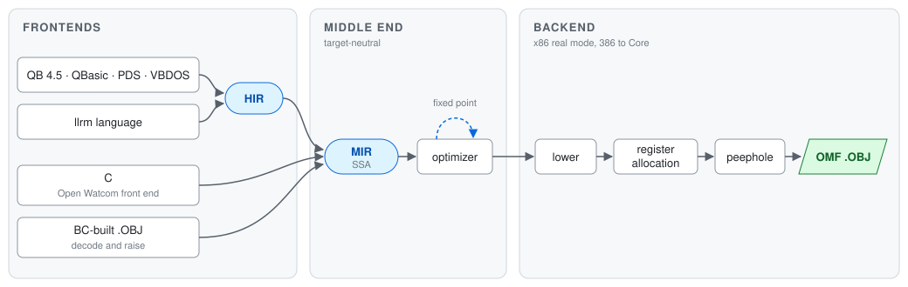

# llrm -- Low Level Real Machine

`llrm` is a compiler suite for 16-bit real-mode DOS that aims at GCC/LLVM-quality
code. Every frontend raises to one SSA IR (MIR), shares one optimizer and x86
backend, and writes linkable OMF `.OBJ` files.



MIR passes are machine-independent; only lowering, allocation and peephole see
registers or instructions. See [the MIR boundary](docs/architecture/split.md). The goal is
output within 1.5× a hand-derived modern-compiler listing for every suite
program; [targets](docs/measurement/targets.md) has the evidence and current gaps.

## Frontends

| Tool | Input |
| --- | --- |
| `llrm-qb` | QuickBASIC-family source: QB 4.5, QBasic 1.1, PDS 7.1, VBDOS, and QuickrBASIC |
| `llrm-c` | C, through a patched Open Watcom front end (`toolchain/owshim/`) |
| `llrm-nib` | llrm's own language; see [the language](docs/frontends/nib/readme.md) |
| `llrm-omf` | OMF objects produced by QuickBASIC's BC, rewritten in place |

QuickrBASIC (`--dialect quickr`) is VBDOS BASIC extended, linked against the VBDOS
runtime. It adds sized and unsigned integers, mandatory declarations, f-strings,
PRIVATE procedures, `+=`, BREAK/CONTINUE, FOR EACH, `a IF c ELSE b`, IN, chained
comparisons, `RETURN value`, tuples, and record and array results. See
[the dialects](docs/frontends/qb/dialects.md).

`FOR EACH x [AS type] IN …` walks a one-dimensional array (`a()`), `RANGE(stop)` or
`RANGE(start, stop[, step])`, the characters of a string, or the array a FUNCTION
`AS t()` returns. `x` is a copy of each element, and BREAK, CONTINUE and EXIT FOR
work as in any loop.

```basic
DIM q AS INTEGER, r AS INTEGER, parity AS STRING
q, r = divmod(17, 5)
FOR EACH i AS INTEGER IN RANGE(q)
    parity = "even" IF i MOD 2 = 0 ELSE "odd"
    PRINT f"{i}: {parity}"
NEXT

FUNCTION divmod (a AS INTEGER, b AS INTEGER) AS (INTEGER, INTEGER)
    RETURN a \ b, a MOD b
END FUNCTION
```

`llrm-c` and `llrm-omf` tune with `--cpu`, 386 through Core. Floating point is native x87, so a
coprocessor is required.

## Use

`cargo build --release` builds everything from a fresh checkout, including `jwasm`, `jwlink`
and the headless DOSBox-X the e2e tests run on, in `target/release`. Their sources are cloned
under `~/.cache/llrm`. Open Watcom's first bootstrap takes about three minutes; set `$OWROOT`
to use an existing tree. On Debian or Ubuntu the build needs:

```sh
sudo apt install build-essential git autoconf automake libtool libpng-dev libpcap-dev libncurses-dev
```

```sh
cargo build --release
target/release/llrm-qb PROGRAM.BAS --dialect qb45 --runtime qb45 -o PROGRAM.OBJ
target/release/llrm-c program.c --opt -o PROGRAM.OBJ
target/release/llrm-nib program.nib -o PROGRAM.OBJ
target/release/llrm-omf PROGRAM.OBJ -o PROGRAMQ.OBJ --cpu 486
```

`llrm-omf` takes every object and library in LINK order when a program spans
modules, and writes nothing unless all of them succeed:

```sh
target/release/llrm-omf MAIN.OBJ DRAW.OBJ BCOM45.LIB --output-dir build/optimized
LINK build/optimized/MAIN.OBJ+build/optimized/DRAW.OBJ,,,BCOM45.LIB
```

Unsupported records, unresolved externals and unencodable code are errors;
`--allow-unchanged` keeps a refused object as it was. `--basic-semantics` keeps
BASIC's numeric runtime errors and conversions, and `--bounds-checks` keeps
array checks. Audited external calls come from `--contracts PROFILE.json`; see
[the profile format](docs/qrender/contracts/readme.md).

## Optimizations

The middle end repeats its MIR passes to a fixed point: constant folding and
propagation, algebraic simplification, GVN, load/store forwarding, promotion,
LICM, loop rotation, unswitching, unrolling and peeling, induction variables and
strength reduction, inlining and dead-code removal.

The backend chooses x86 address forms, uses 32-bit registers and arithmetic in
real mode on the 386 and later, allocates registers with coalescing, live-range
splitting and spill placement, then runs machine CSE, copy propagation,
peephole, scheduling and jump layout. The BC frontend adds recognition of BC's
LONG register pairs, runtime arithmetic calls and array descriptors; see
[HARR](docs/optimizations/harr.md) for a before and after.

## Example

```c
long dot(const int *a, const int *b, int n)
{
    long total = 0;
    int i;
    for (i = 0; i < n; i++)
        total += (long)a[i] * b[i];
    return total;
}
```

`llrm-c dot.c --opt --cpu 486` gives, for the medium model:

```asm
_dot proc far
    push bp
    mov bp, sp
    push si
    push di
    xor eax, eax
    mov bx, word ptr [bp+10]    ; n
    mov si, word ptr [bp+6]     ; a
    mov di, word ptr [bp+8]     ; b
    cmp bx, 0
    jle done
loop:
    movsx ecx, word ptr [si]
    movsx edx, word ptr [di]
    imul ecx, edx               ; 32-bit product, no runtime helper
    add eax, ecx
    add si, 2                   ; i is gone: both pointers step
    add di, 2
    dec bx                      ; the loop counts down to zero
    jne loop
done:
    shld edx, eax, 16           ; return the long in DX:AX
    pop di
    pop si
    pop bp
    retf
_dot endp
```

## Validate

```sh
cargo test --release <name>
```

For every failure, dump every stage and diff the first changed pair. Every fix
needs a regression that fails before the fix. Testing details are in
[docs/testing.md](docs/testing.md).
