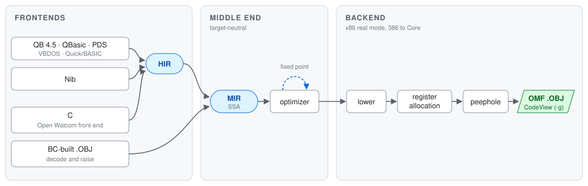

# llrm -- Low Level Real Machine

`llrm` is a compiler suite for 16-bit real-mode DOS that aims at GCC/LLVM-quality
code. Every frontend raises to one SSA IR (MIR), shares one optimizer and x86
backend, and writes linkable OMF `.OBJ` files.



MIR passes are machine-independent; only lowering, allocation and peephole see
registers or instructions. See [the MIR boundary](docs/architecture/split.md). The goal is
output within 1.5× a hand-derived modern-compiler listing for every suite
program; [targets](docs/measurement/targets.md) has the evidence and current gaps.

## Frontends

| Tool | Input |
| --- | --- |
| `llrm-qb` | QuickBASIC-family source: QB 4.5, QBasic 1.1, PDS 7.1, VBDOS, and QuickrBASIC |
| `llrm-c` | C, through a patched Open Watcom front end (`toolchain/owshim/`), in Borland's medium model |
| `llrm-nib` | Nib, llrm's own language; see [the language](docs/frontends/nib/readme.md) |
| `llrm-omf` | OMF objects produced by QuickBASIC's BC, rewritten in place |
| `llrm-mir` | MIR text: verifies it and writes it back; `--run` executes it on the interpreter, `--ivs` counts each innermost loop's induction variables |
| `llrm-run` | Runs a Nib module's entry on the host HIR interpreter |
| `nib-lsp` | Nib's language server; see [the server](docs/frontends/nib/lsp.md) |

QuickrBASIC (`--dialect quickr`) is VBDOS BASIC extended, linked against the VBDOS
runtime. It adds sized and unsigned integers, mandatory declarations, f-strings,
PRIVATE procedures, `+=`, BREAK/CONTINUE, `FOR x IN`, `a IF c ELSE b`, IN, chained
comparisons, `RETURN value`, tuples, record and array results, and string slices
`s(a:b:c)`. See [the dialects](docs/frontends/qb/dialects.md).

`FOR x [AS type] IN …` walks a one-dimensional array (`a()`), `RANGE(stop)` or
`RANGE(start, stop[, step])`, the characters of a string, or the array a FUNCTION
`AS t()` returns. `x` is a copy of each element, and BREAK, CONTINUE and EXIT FOR
work as in any loop.

```basic
DIM q AS INTEGER, r AS INTEGER, parity AS STRING
q, r = divmod(17, 5)
FOR i IN RANGE(q)
    parity = "even" IF i MOD 2 = 0 ELSE "odd"
    PRINT f"{i}: {parity}"
NEXT

FUNCTION divmod (a AS INTEGER, b AS INTEGER) AS (INTEGER, INTEGER)
    RETURN a \ b, a MOD b
END FUNCTION
```

The compilers and `llrm-omf` tune with `--cpu`, 386 through Core. Floating point is native x87, so a
coprocessor is required.

## Use

`cargo build --release` builds everything from a fresh checkout, including `jwasm`, `jwlink`
and the headless DOSBox-X the e2e tests run on, in `target/release`. Their sources are cloned
under `~/.cache/llrm`. Open Watcom's first bootstrap takes about three minutes; set `$OWROOT`
to use an existing tree. On Debian or Ubuntu the build needs:

```sh
sudo apt install build-essential git autoconf automake libtool libpng-dev libpcap-dev libncurses-dev
```

```sh
cargo build --release
target/release/llrm-qb PROGRAM.BAS --dialect qb45 --runtime qb45 -o PROGRAM.OBJ
target/release/llrm-c program.c -o PROGRAM.OBJ
target/release/llrm-nib program.nib -o PROGRAM.OBJ
target/release/llrm-omf PROGRAM.OBJ -o PROGRAMQ.OBJ --cpu 486
```

`llrm-qb`, `llrm-c` and `llrm-nib` share their options:

| Option | Does |
| --- | --- |
| `-O0` `-O1` `-O2` `-O3` `-Os` `-Oz` `-Og` | Optimization level; `-O2` is the default |
| `-f[no-]PASS` | One pass on or off, by gcc's name: `unroll-loops`, `peel-loops`, `inline-functions`, `strength-reduce`, `unswitch-loops`, `gcse`, `tree-dse`, `tree-dce`, `tree-sra`, `move-loop-invariants`, `tree-loop-distribute-patterns` |
| `--cpu CPU`, `-march`, `-mtune` | The processor, `386` through `Core` |
| `-fsanitize=bounds,integer-divide-by-zero,signed-integer-overflow,undefined`, `-ftrapv` | The run-time checks BC's `/D` makes, as gcc names them |
| `-g` | CodeView line numbers, symbols and types, for `LINK /CO` and CodeView |
| `-S` | Writes the assembly listing instead of an object |
| `--dump DIR` | Writes every stage to `DIR`, for diffing |

`llrm-qb` also takes `--own-frames`, which frames procedures without the runtime's
`B$ENRA`/`B$EXSA` wherever the runtime needs no frame of its own.

`llrm-omf` takes every object and library in LINK order when a program spans
modules, and writes nothing unless all of them succeed:

```sh
target/release/llrm-omf MAIN.OBJ DRAW.OBJ BCOM45.LIB --output-dir build/optimized
LINK build/optimized/MAIN.OBJ+build/optimized/DRAW.OBJ,,,BCOM45.LIB
```

Unsupported records, unresolved externals and unencodable code are errors;
`--allow-unchanged` keeps a refused object as it was. `--basic-semantics` keeps
BASIC's numeric runtime errors and conversions, and `--bounds-checks` keeps
array checks. Audited external calls come from `--contracts PROFILE.json`; see
[the profile format](docs/qrender/contracts/readme.md).

## Optimizations

The middle end repeats its MIR passes to a fixed point: constant folding and
propagation, algebraic simplification, GVN over MemorySSA (which also forwards
loads and stores and reuses quotients), dead-store and dead-code removal,
promotion of memory to values, LICM, loop rotation, unswitching, unrolling and
peeling, induction variables and strength reduction, memset recognition,
inlining, and interprocedural facts: which calls read or write what, and which
never return.

The backend chooses x86 address forms, uses 32-bit registers and arithmetic in
real mode on the 386 and later, allocates registers with coalescing, live-range
splitting and spill placement, then runs machine CSE, copy propagation,
peephole, scheduling and jump layout. The BC frontend adds recognition of BC's
LONG register pairs, runtime arithmetic calls and array descriptors; see
[HARR](docs/optimizations/harr.md) for a before and after.

## Example

One loop in three languages: a dot product of two `int` arrays, returned as a
`long`. The sources are in [examples/dot](examples/dot); each listing is what `-S`
prints with `--cpu 486`, and the comments are added by hand. C is in the medium model.

C, `llrm-c dot.c --cpu 486 -S`:

```c
long dot(const int *a, const int *b, int n)
{
    long total = 0;
    int i;
    for (i = 0; i < n; i++)
        total += (long)a[i] * b[i];
    return total;
}
```

```asm
_dot proc far
    push bp                         ; a is [bp+6], b [bp+8], n [bp+10]; the caller pops them
    mov bp, sp
    push si                         ; si and di are callee-saved
    push di
L0_0:
    mov di, word ptr [bp+8]         ; di = b
    mov bx, word ptr [bp+10]        ; bx = n
    mov cx, bx
    neg cx                          ; cx = -n, the loop counter
    xor eax, eax                    ; total = 0
    or bx, bx
    jle L0_3                        ; n <= 0: no iterations
L0_20:
    xor bx, bx                      ; bx = byte offset of a[i] and b[i]
L0_5:
    mov si, word ptr [bp+6]         ; si = a, reloaded on every iteration
    movsx edx, word ptr [bx+si]     ; a[i], sign-extended to 32 bits
    movsx esi, word ptr [bx+di]     ; b[i]
    imul edx, esi                   ; (long)a[i] * b[i], no runtime helper
    add eax, edx                    ; total += product
    add bx, 2                       ; the offset steps by one int
    inc cx                          ; the counter steps up to zero
    jne L0_5                        ; on inc's flags: no compare
L0_3:
    shld edx, eax, 16               ; the long returns in DX:AX
    pop di
    pop si
    pop bp
    retf
_dot endp
```

Nib, `llrm-nib dot.nib --entry dot --cpu 486 -S`:

```
fn dot(a: &[i16], b: &[i16]) -> i32:
    let mut total: i32 = 0
    for (x, y) in zip(a, b):
        total += i32(x) * i32(y)
    return total
```

```asm
_dot proc far
    push bp                         ; a is the far pointer [bp+6], b [bp+10]
    mov bp, sp
    sub sp, 4                       ; two slots for the lengths
    push si
    push di
L0_0:
    les si, dword ptr [bp+6]        ; es:si = a's slice: length, then data pointer
    lfs di, dword ptr [bp+10]       ; fs:di = b's slice
    mov ax, word ptr es:[si]
    mov word ptr [bp-2], ax         ; len(a)
    mov ax, word ptr fs:[di]
    mov word ptr [bp-4], ax         ; len(b)
    les si, dword ptr es:[si+4]     ; es:si = a's data
    lfs di, dword ptr fs:[di+4]     ; fs:di = b's data
    xor dx, dx                      ; dx = i = 0
    xor eax, eax                    ; total = 0
    jmp L0_7
L0_24:
    cmp dx, word ptr [bp-4]         ; zip ends with the shorter slice
    jae L0_22
L0_11:
    lea bx, [edx+edx]               ; bx = 2*i: the low 16 bits of a 32-bit lea
    movsx ecx, word ptr es:[bx+si]  ; a[i]
    movsx ebx, word ptr fs:[bx+di]  ; b[i]
    imul ecx, ebx
    add eax, ecx                    ; total += product
    inc dx
L0_7:
    cmp dx, word ptr [bp-2]         ; i < len(a)
    jb L0_24
L0_22:
    shld edx, eax, 16               ; the long returns in DX:AX
    pop di
    pop si
    leave
    retf
_dot endp
```

A Nib slice is a far pointer to its length and data pointer. `zip` pairs the
elements until the shorter slice ends, so there is no `n`, and no index to check.
Indexing, `a[i]`, checks every access and calls `N$EBND` on a bad one.

BASIC, `llrm-qb dot.bas --dialect qb45 --runtime qb45 --cpu 486 -S`:

```basic
FUNCTION Dot& (a() AS INTEGER, b() AS INTEGER, n AS INTEGER)
    DIM total AS LONG, i AS INTEGER
    FOR i = 0 TO n - 1
        total = total + CLNG(a(i)) * b(i)
    NEXT
    Dot& = total
END FUNCTION
```

```asm
DOT proc far
L1_0:
    mov cx, 2                       ; B$ENRA builds the frame: cx = 2 bytes of locals,
    mov bx, 0                       ; bx = 0 temporary strings
    call far ptr B$ENRA
    mov si, word ptr [bp+10]        ; a() descriptor: the arguments were pushed left to right
    mov di, word ptr [bp+8]         ; b() descriptor
    mov bx, word ptr [bp+6]         ; n is passed by reference
    mov bx, word ptr [bx]           ; bx = n
    dec bx                          ; bx = n - 1
    mov ax, word ptr [si+2]         ; a's data segment
    mov cx, word ptr [si+10]        ; a's data offset
    mov word ptr [bp-12], cx        ; kept in the frame
    mov es, ax                      ; es = a's segment
    mov fs, word ptr [di+2]         ; fs = b's segment
    mov di, word ptr [di+10]        ; di = b's offset
    mov cx, bx
    inc cx
    neg cx                          ; cx = -n, the loop counter
    xor eax, eax                    ; total = 0
    or bx, bx
    jl L1_35                        ; n - 1 < 0: no iterations
L1_37:
    xor bx, bx                      ; bx = byte offset of a(i) and b(i)
L1_20:
    mov si, word ptr [bp-12]        ; si = a's offset, reloaded on every iteration
    movsx edx, word ptr es:[bx+si]  ; a(i), sign-extended
    movsx esi, word ptr fs:[bx+di]  ; b(i)
    imul edx, esi                   ; CLNG(a(i)) * b(i)
    add eax, edx                    ; total += product
    add bx, 2                       ; the offset steps by one INTEGER
    inc cx                          ; the counter steps up to zero
    jne L1_20                       ; on inc's flags: no compare
L1_35:
    shld edx, eax, 16               ; the long returns in DX:AX
    call far ptr B$EXSA             ; the runtime takes the frame down
    retf 6                          ; and the callee pops the three arguments
DOT endp
```

An array is a descriptor: its segment goes in `es` or `fs` before the loop.
`B$ENRA` and `B$EXSA` are the runtime's frame; `--own-frames` replaces them with a
plain one.

All three accumulate the long product in `eax` with `imul`, without a runtime
call. C and BASIC count the index from `-n` up to zero.

## Debug

`-g` makes an object carry CodeView line numbers, symbols and types. `LINK /CO`
and CVPACK accept it, and CodeView shows the source, locals, parameters and
`TYPE`s. [debugging.md](docs/debugging.md) finds a miscompile in a running DOS
program with dosrun: break on write, stack traces and map-file symbols.

## Validate

```sh
cargo test --release <name>
uv run --project tools python tools/loops/run.py --quick
```

The second command runs the loop corpus: one loop program per case, written once
and emitted as C, QuickBASIC and Nib. An independent oracle checks each result,
in llrm-mir's interpreter and on DOSBox. Each inner loop's induction variables,
reloads and size are measured from the object's bytes, against bounds derived
from the target and against gcc-ia16 and Open Watcom. `tools/loops/known.toml`
lists what falls short today; a run fails for a shortfall not listed and for a
listed one that is gone. Without `--quick` it covers every case, CPU and `-O`
level, in about 23 minutes. [tools/readme.md](tools/readme.md) lists the other
tools.

For every failure, dump every stage and diff the first changed pair. Every fix
needs a regression that fails before the fix. Testing details are in
[docs/testing.md](docs/testing.md).
